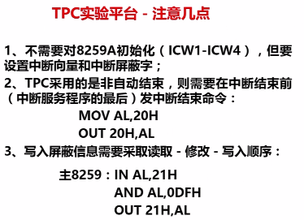

8259用来管理外部的**可屏蔽**中断

当CPU获得8259报告的中断号后，中断号乘4得到中断向量表的地址，去这个地址找中断服务程序的入口地址

首先对ICW1到ICW4的写入

修改中断矢量表

对不必要中断的屏蔽，初始化OWC1

设置中断结束方式OCW2

等待中断（需要开中断，否则中断无法进入 STI)

中断服务程序

①保护现场

②开中断（允许中断嵌套时可选）

③服务程序

④关中断

⑤送中断的结束命令

⑥解除屏蔽

0、1、2、3、5前面5个中断都是特殊的中断

0、1、3、4是**内部中断**，**不可屏蔽**，不需要硬件连接

2是外部中断，从NMI管脚引入，是**不可屏蔽的硬件中断**

**可屏蔽硬件中断**不加扩展的话只有一个中断，但实际上能够打断CPU的中断远远超过一个（因为能够采用接口芯片）

不可屏蔽的管脚：NMI

可屏蔽的管脚：INTR，由于只有一个，所以需要有接口芯片：中断控制器，通过中断控制器把一个接口扩展到8个

中断矢量表明程序被打断后要跳到哪里去

有多少个中断类型号就有多少个中断的入口地址

存放中断矢量的（跳到哪里去）的表叫做中断矢量表

一共256个中断，每个中断有一个地址

存放偏移地址+段地址需要4个字节

所以**中断矢量表**所占的空间为256*4=1KB

0-31中断号用户不能使用

什么叫做从中断返回？？？IRET

从子程序返回是RET？所以意思是编写中断程序的时候最后都需要加一个IRET？

为什么要关中断？因为需要进行三部曲（保护断电、保护标志寄存器&寄存器状态)，否则又有其他中断来了怎么办

这个25H有什么作用?**设定**:系统功能25H调用是什么意思

高速的设备和低速的设备之间有接口

8259就是把中断引入CPU,具有中断申请、中断屏蔽还有中断嵌套的功能

接口芯片一边对应着CPU一边对应着外部设备

CPU通过数据缓冲器

CPU通过地址线来选择8259，因为只有一根地址线，所以8259只有奇偶两个地址

可以级联用

对外有8个管脚，分别是IR0到IR7（中断请求管脚）通过这8个管脚可以引进8个设备来进行中断

级联：

主片的每个输入可以扩展一片，8个输入就能扩展8片

每个芯片再扩展8个，最终8*8=64个中断

8259多片可以管理64个外部中断

emmm这个和80x86 CPU 256个中断有什么关系？内部？外部？

没关系吧

完全嵌套：优先级别固定，允许级别高的中断请求进入  IR0最高，IR7最低

A0

ICW1-4 OCW1-3有7个寄存器

ICW1的D0固定为1，D2固定为0

在8259工作之前设置ICW1-4

## 11.1中断

8259只有两个端口

主程序&中断服务程序

外部设备：interrupt

内部的特定事件产生中断：int 21H

中断&子程序区别:子程序转移通过修改地址指针IP:目的地址和断点地址之间算偏移,如果跨段,还要修改CS

中断被打断后执行中断服务程序,找中断服务程序的原理不同

## 11.2 中断类型

### 硬中断(外部中断)	

1.可屏蔽中断INTR

​	外设通过**中断控制器的请求引脚**INTR向CPU发中断请求

2.不可屏蔽中断NMI		**2号**

​	通过**中断请求线**NMI线向CPU申请

### 软中断(内部中断)

①发出中断指令 INT n产生 ：DOS和BIOS功能调用

②内部突发引起：**0 1 3 4号**

外部中断是随机事件，而软中断不是

## 11.3中断号

怎么找中断服务程序的地址?

中断号*4结果是地址,里面存的还是地址,执行的中断服务程序第一条指令的地址，称为中断服务程序的入口地址

为什么乘4？每个地址占两个单元（16位）

中断号的获取: 

①可屏蔽中断:在<u>中断响应周期</u>从**中断控制器**8259获取

②软中断：由中断指令直接给出

③不可屏蔽中断就是2号，预先设定

如果是内部中断没有中断响应周期,直接执行服务程序

#### 11.3.2中断响应周期

ALE有效标志着响应周期的开始

8086有两个应答信号\INTA1和\INTA2做了不同的事情

##### \INTA1

①产生lock,总线锁定

②响应第几个引脚,就将8259的ISRi(中断服务寄存器)对应的信号置位1,同时将提中断的引脚清零(屏蔽其他的所有中断源**请求**),不让其他的再提中断请求

其他的中断请求如果优先级没有比正在响应的中断请求的优先级高,一般不再响应.公告作用.

<u>如果在中断服务结束后不把ISR的那一位置回0,最后别忘了ISR置0!!!否则中断只能执行一次</u>

EOI结束动作:中断结束指令,专门用来把ISR中置位的那一位变为0,其他的中断请求门才能打开,也可以自动清零,不影响后续较低级别的中断请求处理

但是/INTA1只是知道是那个**引脚提中断请求,并不知道中断号(中断向量号)是什么**

##### \INTA2:

撤掉lock,8259通过数据线向CPU发送**中断号N**

### 11.4中断触发方式与中断排队方式

软件中断>不可屏蔽中断>可屏蔽中断

中断嵌套

当CPU正处理某个中断**<u>(中断服务程序)</u>**时,出现更高级中断源的申请,CPU必须暂停该中断服务

### 11.5 中断向量与中断向量表

! 首先要将我写的程序的入口地址写到中断向量表里

中断向量表本身是个索引表

中断向量表的填写!(要看)

***<u>内部中断N都告诉了,直接执行中断服务程序就行</u>***

### 11.6 中断处理过程

#### 阶段1:通过8259的中断请求引脚发中断请求信号

书67页

前提:<u>IF是总开关</u>,只有是1,CPU才响应可屏蔽中断

手头正在执行的指令执行完了

<u>*8259通过INTR向CPU发中断请求,然后才会进入中断响应周期,CPU发两个INTA*</u>

#### 阶段2:标志位的处理与断点保存

中断涉及标志位,子程序不涉及

①标志寄存器的16位全部压入堆栈

②自动把IF=0

几行前提到,响应中断的前提是<u>IF=1</u>,响应之后又会把IF关掉

(开中断把IF置1,否则不允许中断嵌套)所以在程序过程中要想允许嵌套一定要开中断)中断服务程序一开始会**开中断**

③再把断点的地址加入堆栈

#### 阶段3:通过N*4转到中断服务程序

中断向量表要修改,老的要保存,新的写进去,然后最后恢复老的

#### 阶段4:返回断点

IRET

##### 11.6.2不可屏蔽中断和软件中断的处理过程

**没有中断响应周期**

VPI通道NMI

### 11.7中断控制器

##### 11.7.1 8259外部特性和内部寄存器

8259中断控制器用来管理外部可屏蔽中断

面向CPU,发两次INTA

总线用来送中断向量号

面向外设:IR0到IR7,通过高电平提中断请求

面向同类芯片:主从  级联

最多一次挂64个中断源(8*8)

谁提中断请求就将IRR的响应位置1

**<u>复习整理</u>**:

IRR是**登记**用的,谁提中断请求就会置1

而ISR是**响应**!!!

IMR控制申请窗口是否打开,如果某一位为0说明窗口开,跟动物园一样

是否响应满足几个前提条件:是不是已申请的中优先级最高的

其次要等正在执行的指令执行完  [跳转到11.6阶段1](11.6中断1)

区分ISRi置1,恢复&&IF恢复置1

#### 11.7.2 8259端口地址

主片:20H-21H

从片:A0H和A1H

#### 11.7.3 8259工作方式

紫色的是重点掌握的

①优先级排队:八个窗口

正在服务的中断源被响应,如果有一个更高级别的中断源提出了新的中断请求,当前的中断服务过程被打断

完全嵌套方式:只允许更高级别的中断进行嵌套

②中断结束:将ISR中被置1的那一位清零

在INTA2(响应周期的第二阶段)的时候就清零:自动结束

非自动结束:

**常规结束方式**:要专门写中断结束指令,在中断服务程序返回之前,指令代码20H或者6XH

③中断屏蔽方式IMR

④中断触发方式:外设用什么来提中断**请求**?边沿or电平(中断请求信号在中断响应期间要一直为高)

8254 GATE和CLOCK都是用上升沿

#### 11.7.4 8259的编程命令

外设提请求,窗口高电平

8259可以选择开关窗口通过IMR  0是开放

排队:优先级排队  利用PR

剩下的优先级最高的中断源的中断号才送给CPU

如何送中断号之后讨论

满足几个前提条件,然后CPU响应,INTA1和INTA2

**将ISR置1**

如果后续外设提出的中断请求不高于当前正在响应的中断请求的时候

CPU执行完了发出EOI**,将ISR置零**,这一次的中断过程才算结束,指的是**<u>*8259结束*</u>**

8259充当了一个CPU门卫的角色

将中断号送给CPU进行执行

#### 11.7.4 8259的编程命令

8259四个初始化命令字

不同的初始化命令字**严格**按照写入顺序来进行区分

(8255用标志位区分方式命令字和C端口控制字,

8259两个口不区分数据口和命令口,都可以当

8259工作时还可以操作命令字

可以实现屏蔽、中断结束命令等等

具体的中断服务程序是CPU干的事情

先写ICW1，向偶数地址的端口写

ICW2：向奇数地址写

【

中断号的获取: 

①可屏蔽中断:在<u>中断响应周期</u>从**中断控制器**8259获取

】

有级联才写ICW3，往奇数地址写

最多一次可以有8*8=64个中断请求，通过级联的方式扩展中断源

主片从片都要初始化

主片哪个挂从片

从片挂到主片哪里

主片的INT和CPU总线连，是专门的中断请求信号

从片的ICW3要写到从片的奇数地址A1H

ICW4：往奇数地址写

系统自动完成初始化

8259已经开始工作，对一些窗口进行动态控制

需要使用操作命令字

#### OCW1：送到奇数地址，**哪一位开放哪一位为0**，其他为1（在主程序中写）

通常在主程序改，进行8259的控制

主程序开中断之前，改的过程中不能来中断

所以一般在做**这种比较关键的操作**之前都是要关中断的

开和关中断不是8259的窗口打开，是关CPU

CPU有一个专门设定响应不响应中断的开关IF

8259的开和关是IMR，控制能不能提中断请求

响不响应中断是CPU自己去决定的，由IF来控制

在CPU开中断（响应中断）之前来修改

**之后修改中断向量的时候**也是这样做的

执行完了IMR就变l

#### OCW2，往偶数地址写（在中断返回之前，在中断服务程序中快结束的时候写，使相应为清零）

改变优先级轮换方式

EOI如果是自动，在中断响应周期的第二阶段将ISR对应位清零

非自动：SL设为0，结束当前中断，最低三位不用定义了，结束的结果是ISR对应位清零

​				SL为1，指定结束哪个中断，有D2D1D0

最后两条指令**20H（结束当前）和6XH（结束哪个）**

如果有级联，优先权如何排队

从片的所有优先级都高于主片的后面的引脚

基本上都是非自动结束

区分指令本身的20H和端口的20H

OCW3：用的少

读取ISR（谁响应） IRR（谁提出中断请求）

巴拉巴拉

用的多：icw2 3 owc1 2

INT是8259发的中断请求信号（它是大管家，比较完了之后，最终通过INT引脚向CPU发送中断请求信号）

11.22 18分左右讲了倒计时和电子琴的原理，在中断服务程序中判断按下的是哪个键

通过CAS0-2来判断是哪个从片向自己提中断

PC机15级向量中断：

主片有7个，从片又挂了8个

主片IR0-IR7上中断号08-0FH

从片IR8-IR15上中断号：70H-77H

## 11.9用户对系统中断资源的使用

中断服务程序要自己写

如何让CPU运行我的

**需要修改中断向量！**

如果中断向量表（中介）把入口地址**改**成我这个程序的入口地址，那不就ok了

写OCW1，OCW2 屏蔽，开放，结束

借用了人家的中断号，最后还要恢复

用dos的35H功能

入口参数：向量号

出口参数 段地址放到ES，偏移地址放到BX

如果我后面程序不在占用ES，BX那就直接放进去就完事了

接下来才可以进行修改

修改利用25H

入口参数AL=向量号

DS表示段地址，DX表示偏移地址

把自己的地址写到原来中断向量的哪个地方（鸠占鹊巢）

（动物园关门了）

而OCW1控制的是8259的那8个中断请求信号

（售票窗口关门了）

如果是关闭IR2用OR

#### 11.9.2 发中断屏蔽/开放 和中断结束只指令

主程序中写OCW1执行中断屏蔽与开放

中断服务程序中写OCW2，发中断结束指令EOI

### 11.9.3 编写中断服务程序

### 11.10 中断服务程序设计

实验箱：

主片用IR5，从片用IR0

段寄存器的值就是0

DS：DI

DS就是0

DI：4*35H

移动指针

offset和seg

自己动手往中断向量表里写

直接修改 ，没考虑保护和恢复

​				

改IMR

OCW2：发中断结束指令

OCW3：设定屏蔽和读取方式

