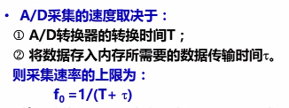
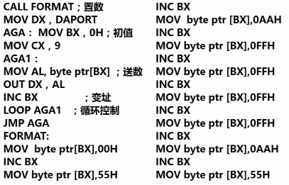

A：模拟信号

D：数字信号

eg:电压->数字		A/D转换  把模拟量转换为数字量

D/A转换 

12.2.1 A/D转换器的主要技术指标

分辨率:能够把模拟量转换为二进制的位数

例:用10位ADC转换一个满量程5V的电压,能分辨的最小电压:5/1000=5mv

小于5mv的分辨不出来,模拟输入值小于5mv,则ADC无反应,输出保持不变

**当分辨率大于微机系统数据总线宽度时,每次转换都需要两次数据的传输**

转换时间：从输入转换启动开始到转换结束，得到稳定的数字量输出为止所需要的时间一般转换速度越高越好

转换时间的快慢将会影响ADC接口与CPU交换数据的方式

12.2.2A/D转换器的外部特性

模拟信号输入线

数字量输出线（线的数量决定分辨率）

转换启动线（输入）每次启动转换**一次**数据

转换结束线（输出）每次ADC作**一次转换**结束

12.3.1A/D转换器与微处理器接口的原理和方法

启动信号,有脉冲启动和电平启动两种

输入,单通道多通道

输出,是否有锁存\分辨率是否与系统数据总线一致(见上面加粗行)

转换结束信号

基本结构是循环程序

12.4 A/D转换接口设计

查询方式：

CPU不停地查询

每一次采集都要重新启动A/D转换

绿色部分是启动信号,执行语句之后会产生CS和WR的有效信号

①首先让CS有效，看图

CS连到了译码器的输出，当译码器的输入是310H的时候，这个引脚会有有效输出

选中这个端口（启动转换端口），向这个端口输出一个数的时候，因为**端口地址选中了310H，就会在译码输出端生成一个有效信号**

向这个地址输出了一个数，执行OUT指令

**CPU在执行OUT指令的时候，本质上产生了一个“写”有效信号**

综上：向地址为310H的端口随便写一个数，就能产生有效的写信号，这样就实现了同时产生两个有效信号的目的，从而启动了ADC的转换

关心的是写的动作：假写

启动完成

接下来CPU查询状态端口310H的第七位是否为0

变为0了，转换结束，数据线上出现的就是转换的结果，赶紧去数据端口（也是310H）把转换的结果读进来

将数据传输到BUFR区

因为有查询，所以有状态端口！

中断方式：

ALE是所有总线操作的起始,是地址选择的开关

首先ALE有效，然后通道地址的锁存器打开，通过3个引脚确定八个引脚要对哪个通道的模拟量做转换，选择才能发到开关这个地方

才能进入ADC内部的比较器的输入端

0809需要专门的启动信号（高电平），只有给一个高电平，整个过程才开始

接下来需要给一个<u>start</u>信号

ADC转换需要时间

转换结束之后会提供一个转换结束的信号，转换结束之前是低电平，产生了一个向上的正跳变沿，正好拿这个信号作为一个**中断**请求信号

这个引脚是练到8259（主片或者从片都可以）

在中断服务程序里面就能够得到转换完成的数据量？nope

这个时候数据在输出的锁存器里面关着，还没有出现在数据总线上

所以进入中断服务程序之后应该首先给一个<u>OE</u>高电平，目的是把锁存器的门打开，此时转换的量才会出现在数据总线上，然后CPU去执行IN指令这样才能把真正转换得到的数据传过来。

要修改中断向量

中断屏蔽的打开

中断服务程序要把OE打开

接口电路结构设计

要提供START信号，EOC是他提供的，还要提供OE信号、ALE信号，这些信号不是CPU直接给的，是接口的功能

用8255来做

8255做接口，功能：

首先提供了ALE和start信号，由PC7提供（可换）

OE是PC6提供的，用C端口的这两个引脚提供三个控制信号

而EOC直接连到了系统的IRQ4上

而数字口（转换完之后的数据量）借用了8255的A端口输入

将转换完的结果通过A端口送给CPU

通道选择信号使用A端口的D0到D2这三个引脚。

如果选择7通道，这三个引脚应该送111

接口电路的设计总共涉及到了3个芯片

主程序中这三个芯片的初始化都要写

8255的4个端口地址

300 301 302对应8255的ABC，命令口是303

8259的端口是偶数地址和奇数地址

ADC是外设，没有涉及到端口地址的概念

软件设计：第一步是初始化

涉及到了几个芯片

①58255要初始化，8259虽然不用初始化，但是要做屏蔽开放和中断向量的修改

②给通道选择信号，给start信号

③等待中断，在中断服务程序里开中断

④转换结束后会通过EOC去申请中断（ADC0809转换一路模拟量结束后，会通过EOC引脚送出来一个高电平）

在中断服务程序中

首先通过PC6给OE一个高电平

从A端口读转换完的数字量

读完后把它放到指定的存储区中，最终要放到存储器

ADC一次启动只转换一个数

重复转换的时候还要给start，后面通道信号不用变，因为一直是通道7采100个数

8255使用方式0

A端口（数据口）

目的是将ADC转换的数据读进来存到内存器里，所以是输入

所以A端口是输入

未涉及B端口，无所谓

C端口PC7和PC4都是输出，都在上半段

应为同时定义4个引脚的输入输出，所以不能一个上一个下

接下来看课件p28

D/A转换器

将数字量变为模拟量

分辨率：DAC能够把多少位二进制数转换成模拟量

外部特性：

不需要专门的start信号

片选信号、写有效信号

DAC不需要专门的控制信号去触发，只要CPU把数据送到输入端，就开始转换

DAC不提供转换结束状态信号

增加锁存缓冲器，提供锁存控制信号

当DA转换器分辨率大于数据总线宽度，需要分两次

产生一些特定形状的波形

两道门全打开：直通

单缓冲

双缓冲方式

0832

第一级锁存器里都有数了，给他们俩统一的XFER（第二个门的开关）

这两个数据同时进入第二个门

DAC也是外设

5个控制信号，利用8255

B口输出做控制信号

转换的数字量通过8255A端口送给数8032

一般用直通方式

生成锯齿波

电压从0到满量程电压

00000000->11111111

0V					5V

三角波:

看课件

表在代码段定义

也可以在数据段定义

