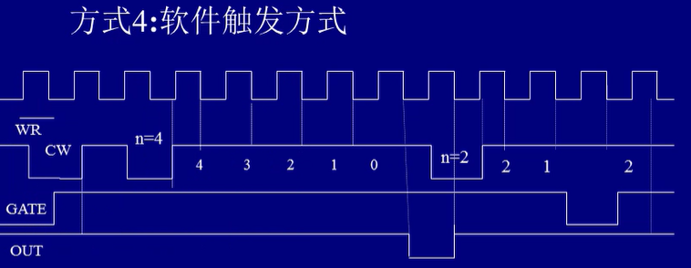

# 接口

- I/O接口的基本构成（桥梁）
  1. 控制信号：CPU->接口，控制接口的**工作方式**
  2. 状态信号：接口->CPU，向CPU提供接口的**工作状态**
  3. 数据：CPU与外设之间交换的信息
- 单片机就是把CPU、存储器和IO都集成到一块了，所以不需要接口


- 接口存在的必要（功能）
  1. **缓冲数据的传送功能**：CPU的速度太快，外设（如键盘）一秒钟就敲几次键，而CPU运行上亿次，匹配不了
  2. **信号量转换**：模拟量（AD，测温度），CPU无法获得
  3. **转换数据格式**：CPU是并行数据，硬盘、USB都是串行数据，需要转换
  4. **定时/计数**：满足总线对数据传送的时序要求
- 接口组成
  1. 数据缓冲单元：暂时**存放**接口发送到CPU的**数据**，有序保证
  2. 读/写控制电路：**接收**CPU发来**命令**，**完成**对接口内部的寄存器的**读/写**
  3. 命令/状态单元：**存放**CPU发送到接口的**命令信息**，状态单元（状态字）存放接口的**工作状态信息**，供CPU查询

- 编址方式（都有大量应用）

  1. 统一编址（单片机）：存储器占的一部分划出来给IO（访问IO的地址很丰富，但是占用了存储器的地址空间，访问IO出错了有可能访问到存储器）

  2. 独立编址（PC机）：IO地址独立，不占用存储器地址空间（需要用专用IO指令访问IO端口）

     **改错题**

     - 直接寻址：可寻址256个端口（IO的地址又叫端口）

       ```assembly
       OUT	80H, AL
       IN	AL, 0FFH
       ```

     - 间接寻址：使用16位地址码，IO端口地址用间接方式给出

       ```assembly
       MOV	DX, 1000H
       OUT	DX, AL
       ```

- CPU控制IO的四种方法

  1. **程序控制方式**（8255）：完全在程序控制下进行，IN和OUT直接访问IO端口，无条件传送数据
     （直接要求学生上交作业）
  2. **查询方式**：询问IO状态（状态字），当接口准备好时CPU开始传输，否则等待（不断地等着）
     （询问作业是否做好，若没做好，一直等待直到做好）
  3. **中断方式**：当外部设备需要输入输出时，向CPU发出中断技术信号
     （学生做完作业后打电话联系老师上交）
  4. **DMA**：直接存储器访问，控制方式是由DMA控制器控制存储器与高速IO设备之间直接进行数据传送
     （学生做完作业后告诉助教，助教直接改完，老师可以处理其他事情）


## 8255

- 结构和引脚信号

  

  PA、PB、PC三个并行口

  

  左边CPU，右边IO接口

  

- 三种工作方式

  1. 方式0：无条件数据传输，基本输入/输出

     ```assembly
     ; 设8255A的IO地址为80H~83H，则无条件传输如下：
     ; 输出时
     MOV	AL, 方式命令字
     OUT	83H, AL
     MOV	AL, 输出数据
     OUT	80H, AL
     ; 输入时
     MOV	AL, 方式命令字
     OUT	83H, AL
     IN	AL, 80H
     ```

     **先送方式命令字，告诉IO接口CPU要干什么，再输入输出；每次只能通过AL，没有为什么**

  2. 方式1：选通输入或输出（A口、B口）

     1. 方式1输入：A口

        STB非（PC4）：选通信号，表示外设送数据到A‘口的输入锁存器

        IBF（PC6）：输入缓冲器满信号，输入锁存器已收到外设送来的数据

        INTR：中断，应该接8259

        INTEA（PC4）：禁止中断，PC4输入时是STB，输出时是中断允许 

        

        

     2. 方式1输入：B口

        PC0、PC1、PC2

     3. 方式1输出：A口

        OBF：输出缓冲器满

        ACK：外设应答信号

     4. 方式1输出：B口

        类似

  3. 方式2：双向选通输入输出（A口）

     输入、输出、中断的握手线都要有，查询、中断都可以实现。PC剩下的管脚可以作为输入输出

     

- 8255A的编程

  1. 控制字格式

     - 工作方式控制字（标志位为1，没用到填0）

       ```assembly
       MOV	AL, 10000110B
       MOV	DX, 0FFE3H		; 注意超过了0FFH，要先送DX
       OUT	DX, AL
       ```

     - 置位复位控制字（标志位为0）

       把剩下没用的PC口设为0或1

  2. 典中典

     

     ```assembly
     DATA SEGMENT
     LIST	DB 0C0H, ..., 8EH		; 对应0~9二极管发光
     PORTA	EQU 0FFC0H
     PORTB	EQU 0FFC1H
     PORTC	EQU	0FFC2H
     CONTR	EQU 0FFC3H
     DATA ENDS
     
     CODE SEGMENT
     ASSUME CS:CODE, DS:DATA
     START:	
     MOV	AX, DATA
     MOV	DS, AX
     
     ; 初始化，方式字送控制口
     MOV	AL, 90H	; 初始化PA输入，PB输出
     MOV	DX, CONTR
     OUT	DX, AL
     		
     L0:		
     ; 读A口
     MOV	DX, PORTA
     IN	AL, DX
     
     AND	AL, 0FH		; 屏蔽高4位，因为只用到了低4位
     MOV	BX, OFFSET LIST		; 取显示代码表首地址>BX
     XLAT		; 根据AL内容查表，BX加上AX去存储器查找送AL
     
     ; B口显示数据
     MOV	DX, PORTB
     OUT	DX, AL
     MOV	CX, 1000	; 延时
     
     L1:
     ; 循环延时
     DEC	CX
     JNZ	L1
     JMP	L0
     
     CODE ENDS
     	 END START
     ```

     > #### 为什么这题里要加延时？
     >
     > 按键抖动问题：
     >
     > 
     >
     > 抖动通常为10ms，所以通常延时10ms再去读


## 8254

- 计时就是计数

- 结构及管脚信号

  

  

  

  减到0时输出

  

- 定时和计数

  1. 做计数器使用：下降沿触发
  2. 做定时器使用：下降沿触发，频率是固定的，计算时可能要除以二，因为一个周期包含了0和1

- 8254的工作方式

  1. 方式0：计数结束中断

     

     写入工作方式，写入初值，方式0的门关闭再打开后是继续数数，计数完了OUT变为高电平，可以申请中断信号

  2. 方式1：单拍负脉冲（单脉冲发生器）

     

     方式1的门关闭再打开后是重新计数，用于做单脉冲的发生器（就发一个，完事了）

  3. 方式2：频率发生器（分频器，速率波发生器）

     

     初值重复装入，连续发负脉冲，宽度是一个周期的宽度，门关闭后停止计数，打开后重新计数，用于发负脉冲序列

  4. 方式3：方波发生器（最常见）

     

     初值重复有效，重复周期一半低电平，一半高电平，初值为奇数时高电平加一个。可以分频，所以几乎可以覆盖所有频率的计数

  5. 方式4：软件触发方式

     

     初值一次有效，计数完后输出一个周期的负脉冲，门关闭再打开重新计数

  6. 方式5：硬件触发方式

     

     门开一下就开始计数，通过管脚触发，输出端输出一个周期的负脉冲

- 8254的编程

  用几个定时器就用几次，00计数器所存，我们想读的时候就送这个数，通常都先低后高写两个

  1. 初始化

     ```assembly
     ; 设计数器1工作在方式0，计数初值1200，采用BCD码计数
     MOV	AL, 71H		; 工作方式控制字
     OUT	83H, AL
     MOV	AL, 00H		; 低8位写入
     OUT	81H, AL
     MOV	AL, 12H		; 高8位写入
     OUT	81H, AL
     ```

     如果是二进制数，可以直接把1200送到某个寄存器（让电脑帮忙转化为16进制），如BL，再`MOV AL, BL`

  2. 读取当前计数值

     ```assembly
     MOV	AL, 01000001B		; 执行锁存，否则读不了
     OUT	83H, AL
     IN	AL, 81H				; 读低8位
     MOV	AH, AL
     IN	AL, 81H				; 读高8位
     XCHG AH, AL				; 交换
     ```

  3. 典中典

     

     三个通道一个一个看

     ```assembly
     ; 通道0
     MOV	DX, 8254控制端口地址
     MOV	AL, 10H				; 通道0，方式0，二进制计数
     OUT	DX, AL
     
     MOV	DX, 通道0端口地址
     MOV	AL, 64H				; 100
     OUT	DX, AL
     
     ; 通道1
     MOV	DX, 8254控制端口
     MOV	AL, 76H				; 通道1，方式3，二进制计数
     OUT	DX, AL
     
     MOV	DX, 通道1端口
     MOV	AX, 09C4H			; 把输入的2.5MHZ进行分频，这里送入的是2500的十六进制
     OUT	DX, AL
     MOV	AL, AH
     OUT	DX, AL
     
     ; 通道2
     MOV	DX, 8254控制端口
     MOV	AL, 0B1H			; 通道2，方式3，BCD计数
     OUT	DX, AL
     
     MOV	DX, 通道2端口
     MOV	AX, 1000H			; 把输入的1KHZ转化为1s，这里送入1000
     OUT	DX, AL
     MOV	AL, AH
     OUT	DX, AL
     ```

     **小总结：如何计算计数初值**

     1. 要发出多少HZ的声音，计算需要多大的周期

     2. 再计算输入频率的周期是多大

     3. 最后除一下（我需要的除以提供的，因为提供的是最小单位），得到需要的分频


## 中断

- 为什么要中断

  1. 重要的事情及时处理
  2. 出现意想不到的事件及时处理
  3. 实现**CPU与低速外部设备的速度匹配与并行工作**（只有按下键盘按键时CPU才来处理）

- 中断类型

  1. 共256种中断，中断号00H~0FFH

  2. 可屏蔽中断、不可屏蔽中断

  3. 内部中断、外部中断

     > #### 内部中断
     >
     > - 软中断：指令中断（10~31H，如INT 21H）
     > - 内部中断和异常：除法出错（00H）、溢出（04H）、单步中断（01H）、断点中断（03H）
     > - 特点：**不可屏蔽**，不需硬件连接
     >
     > #### 外部中断
     >
     > （鼠标移动的时候就一直在发中断，增加CPU利用率，如果利用率达到100%，鼠标就动不了了）
     >
     > - 不可屏蔽硬件中断（02H）：由NMI端引入的中断请求，不可被屏蔽
     > - 可屏蔽硬件中断请求：由INTR端引入，中断请求可由IF = 0进行屏蔽，使中断请求不进入
     >
     > > #### 中断优先级
     > >
     > > 由高到低如下（高级中断打断低级中断）
     > >
     > > 1. 内部中断和异常
     > > 2. 软件中断
     > > 3. 外部不可屏蔽中断
     > > 4. 外不可屏蔽中断
     > > 5. 单步中断

- 中断矢量表

  存放中断服务程序入口地址的存储空间（存储器00000H~003FFH，共1K字节）

  

  中断号 × 4 = 入口地址

- 中断处理过程

  1. 中断申请

     硬件产生一个中断请求信号INTR发送给CPU，CPU在**每条**指令结束时检测INTR

  2. 中断响应

     检测：检测到有中断请求且**IF = 1（允许中断）**时，总线周期信号000，通过总线控制逻辑发中断响应

     应答：INTA给中断请求设备表示应答。

     - 中断请求设备将中断号送上数据总线
     - 系统自动进入中断响应周期，由硬件完成**关中断、保存断点（断点压栈）取中断服务的入口地址（N * 4）**等一系列操作，而后转向中断服务程序执行中断处理（最后要返回RET）

  3. 中断处理

     执行中断服务程序中规定的操作

  4. 中断返回

     将压栈的断点从堆栈中弹出，开中断，CPU转向中断的主程序继续执行

  

- 和中断相关的指令

  | 指令    | 作用                             |
  | ------- | -------------------------------- |
  | STI     | IF = 1，允许可屏蔽中断请求进入   |
  | CLI     | IF = 0，不允许可屏蔽中断请求进入 |
  | INT n   | 软中断（指令中断）               |
  | IRET    | 中断返回                         |
  | INTO    | 溢出中断                         |
  | LIDT EA | 装入中断描述符表寄存器IDTR       |
  | SIDT EA | 保存中断描述符表寄存器           |

- 可屏蔽中断的允许和禁止

  在处理完一些特殊的东西之后就应该允许更高级的中断进入了

  > **既然都要开中断，那为什么要关？**
  >
  > 1. 要保护断点啊（压栈）！不然怎么回去
  > 2. 保护现在的标志寄存器状态
  > 3. 保护现在的寄存器状态

- 中断入口地址的设定和读取

  **设定：系统功能25H调用**

  - AH，25H
  - DS：DX，中断服务程序入口地址
  - AL，中断类型号

  ```assembly
  ; 设中断号40H，中断服务程序入口地址标号INT-P，则
  MOV	AH, 25H
  MOV	AL, 40H
  MOV	DX, SEG INT-P		; 段地址
  MOV	DS, DX
  MOV	DX, OFFSET INT-P	; 偏移地址
  INT	21H
  ```

  **读取：系统功能35H调用**

  - AH，35H

  - AL，中断类型号

    出口参数

  - ES：BX，就变成了中断服务程序入口地址

  ```assembly
  ; 设中断号40H，读取对应的中断服务程序入口地址
  MOV	AH, 35H
  MOV	AL, 40H
  INT	21H
  ```

  （可以用于汉字处理：找到处理英文的中断地址，替换为处理汉字的）


## 8259


INTA：中断响应

INT：中断，连INTR

IR：中断请求


CAS0\~CAS2，SP/EN，可以用作级联、扩展（000\~111，8个）

中断服务寄存器，ISR表明正在服务哪个中断

中断屏蔽寄存器，mask

- 级联方式连接

  

  INT接IR

- 工作方式

  1. **预置命令字：ICW1-4，定好的**
  2. **操作命令字：OCW1-3，7个寄存器，运行过程中可以随时改变**

  #### 1. 中断优先权方式

  - 固定优先权（中断嵌套方式，ICW4设定）

    完全嵌套：优先级别固定，允许级别高的中断请求进入

    特殊完全嵌套：允许高级和同级的中断请求进入，**级联时主8259采用此方式（同级的就是同一从片发来的请求都会同意）**

  - 自动循环方式

    普通自动循环：第一次给IR0，中断后变最低

    特殊自动循环：指定一个优先级最高或最低，再循环

  

  #### 2. 中断屏蔽方式（初始化就写了）

  普通屏蔽方式：OCW写1，对应的IRi屏蔽

  特殊屏蔽方式：只对同级的中断请求进行屏蔽，用于**级联方式中的主片（// TODO哪来的同级？？？）**

  

  #### 3. 中断结束方式

  $$
  ICW4
  \begin{cases}
  自动结束: 在中断处理结束后自动将ISR中的响应位清除\\
  非自动结束: 在中断处理结束后发OCW2命令将ISR中的相应位清除
  \end{cases}
  $$

  $$
  OCW2
  \begin{cases}
  普通结束方式: 发OCW2操作命令字向8259A送EOI命令来清除ISR中当前优先级别最高位。适用于完全嵌套方式\\
  特殊结束方式: 发OCW2命令字向8259A送EOI命令，同时送复位的ISR对应位。适用于优先级循环方式
  \end{cases}
  $$

  

  #### 4. 中断触发方式

  - 电平触发：高电平有效，要求保持一定时间
  - 边沿触发：由低到高的正跳变

  电平触发是不带记忆的，边沿触发是带记忆的

  

  #### 5. 总线连接方式

  - 缓冲方式：8259通过总线驱动器和系统数据线相连，此时EN为输出端，作为总线驱动器的启动信号。用于多个8259与系统相连时
  - 非缓冲方式（通常都用这个）：8259数据线直接与系统数据线相连。此时，主片的SP接高电平，从片的SP接低电平

- **8259的编程（ICW初始化）**

  

  0是偶地址，1是奇地址

  0，00010000~00011111

  

  例，中断类型号20H\~28H，就是**00100**000\~**00100**111

  

  主片接了是1，没接是0；从片接的是几就写几

  

- **8259的编程（OCW）**

  

  屏蔽字设置

  

  中断优先级和中断结束方式（001最常用，实在不会就写这个了）

  

  复位特殊屏蔽：就是改成普通屏蔽方式

  设置特殊屏蔽：变成特殊屏蔽方式（级联主片）

  查询状态，设D~2~为1

  OCW2和3可以通过D~3~来判断

  ```assembly
  ; 设8259的IO接口地址为80H，81H
  ; 读ISR
  MOV	AL, 00001011B
  OUT	80H, AL
  IN	AL, 80H
  ; 读IRR
  MOV	AL, 00001010B
  OUT	80H
  IN	AL, 80H
  ; 读IMR不需要设OCW3，直接读奇地址即可
  IN	AL, 81H
  ```

- **8259的编程（状态字）**

  

  D~7~为1表示有中断请求，对应编号为D~0~\~D~2~表示的编码

  **读状态字要先写OCW3**，再用IN读出来

```assembly
; 设单片8259定义为完全嵌套、非自动结束方式、边沿触发，中断类型08H~0FH，端口地址20H~21H，编写初始化程序

; ICW1，偶地址
MOV	AL, 00010011B
OUT	20H, AL
; ICW2，奇地址
MOV	AL, 00001000B
OUT	21H, AL
; ICW4，奇地址
MOV	AL, 00000001B
OUT	21H, AL
```

- 例子

  某系统中设置两片8259实现中断控制，它们之间采用级联方式连接，从8259的INT端与主8259的IR3相连

  已知当前主8259的IR0和IR5端分别引入两个中断请求，从8259的IR2和IR3端分别引入两个中断请求

  设主8259引入的中断类型码为40H\~47H，IO地址0FFE8H，0FFE9H，中断入口地址已装入矢量表

  从8259引入的中断类型码为30\~37H，IO地址0FFFAH，0FFFBH，中断入口地址已装入矢量表

  

  ```assembly
  ; 主8259初始化
  ; ICW1
  MOV	AL, 00010001B
  MOV	DX, 0FFE8H			; 不能直接OUT，因为地址超过0FFH
  OUT	DX, AL
  
  ; ICW2
  MOV	AL, 01000000B
  MOV	DX, 0FFE9H
  OUT	DX, AL
  
  ; ICW3
  MOV	AL, 08H
  OUT	DX, AL
  
  ; ICW4
  MOV	AL, 11H
  OUT	DX, AL
  
  
  ; OCW1，中断屏蔽字，悬空的口屏蔽掉
  MOV	AL, 0D6H
  OUT	DX, AL
  
  ; OCW2，普通EOI结束，防止前面有中断没关
  MOV	AL, 20H
  MOV DX, 0FFF8H
  OUT	DX, AL
  ```

  从片和主片初始化类似

- 难中难

  中断请求信号以跳变方式由IR2引入，编写程序，当CPU响应IR2请求时，输出显示字符串“ASDASD”，中断10次后退出

  设8259的IO地址为20H，21H，**中断类型号0AH，从IR2引入**

  ```assembly
  DATA SEGMENT
  MESS DB 'ASDASD', 0AH, 0DH, '$'
  INTA00	EQU 0020H
  INTA01	EQU 0021H
  DATA ENDS
  
  ; 只要有中断，就要有堆栈
  STACK SEGMENT STACK
  STA	DB 100H DUP(?)
  TOP	EQU LENGTH STA
  STACK ENDS
  
  CODE SEGMENT
  ASSUME CS:CODE, DS:DATA, SS:STACK
  MAIN:
  MOV	AX, DATA
  MOV	DS, AX
  ; 装入SS、SP
  MOV	AX, STACK
  MOV	SS, AX
  MOV	SP, TOP
  
  ; 8259初始化
  ; ICW1
  MOV	DX, INTA00
  MOV	AL, 13H
  OUT	DX, AL
  ; ICW2
  MOV	DX, INTA01
  MOV	AL, 08H		; 要求0AH，不过08H已经能包含了
  OUT	DX, AL
  ; ICW4
  MOV	AL, 01H
  OUT	DX, AL
  
  ; 中断服务程序，DS:DX
  PUSH DS
  MOV	AX, SEG INT-P	; 设置中断矢量
  MOV	DS, AX
  MOV	DX, OFFSET INT-P
  MOV AL, 0AH			; 要编的类型号
  MOV AH, 25H
  INT 21H
  POP DS
  ; 发生IR2中断（因为只有一个IR2），会自动到中断矢量0AH来
  
  ; 写中断屏蔽字OCW1，不用的屏蔽
  MOV	AL, 0FBH
  OUT DX, AL
  
  ; 中断结束方式OCW2，防止之前中断没结束
  MOV	DX, INTA00
  MOV	AL, 20H			; 普通中断结束
  OUT DX, AL
  
  
  ; 中断要做的事情
  MOV	BX, 1O
  WAIT:
  STI			; 开中断
  JMP	WAIT	; 等待中断
  
  INT-P:
  MOV	AX, DATA	; 中断服务程序入口，保险起见再装一次
  MOV	DS, AX
  MOV	DX, OFFSET MESS		; 输出字符串
  MOV	AH, 09H
  INT 21H
  ; 送中断结束命令EOI
  MOV	DX, INTA00
  MOV	AL, 20H
  OUT	DX, AL
  
  DEC	BX
  JNZ NEXT
  
  ; 读屏蔽寄存器IMR，中断10次后屏蔽IR2请求
  MOV	DX, INTA01
  IN	AL, DX
  OR	AL, 04H		
  OUT	DX, AL
  STI				; 开中断
  MOV	AX, 4C00H
  INT	21H
  
  NEXT:
  ; 中断返回
  IRET
  
  CODE ENDS
  	 END MAIN
  ```

  

## ADDA（Analog、Digital）


- AD: 模拟量转化为数字量（设置阈值）；DA: 数字量转化为模拟量

- 输出数据宽度有8、10、16、20位等

- **AD转换器的主要技术指标**

  1. 分辨率：
     - 指AD转换器能把模拟量转换成二进制的位数（10位ADC转换一个满量程为5V的电压，则能分辨的最小电压为5mV）
     - ADC的数字量输出位数越多，分辨率就越高
     - 当分辨率大于微机系统数据总线宽度时，每次转换需要两次数据传输
  2. 转换时间
     - 指从输入**转换启动开始到转换结束t**，**得到稳定的数字量输出tao**为止需要的时间（t + tao的倒数是频率）
     - 一般转换速度越高越好

- **外部特性**

  1. 模拟信号输入线：有单通道多通道之分
  2. 数字量输出线：线的数量决定分辨率
  3. 转换启动线（输入）：每次启动转换一次数据
  4. 转换结束线（输出）：表示ADC作一次转换结束

- **原理和方法**

  1. ADC的启动信号：脉冲启动、电平启动
  2. ADC的输入信号：单通道、多通道
  3. ADC的输出信号：ADC输出是否有锁存；ADC分辨率是否与系统数据总线宽度一致
  4. ADC的转换结束信号：作为查询和中断的依据

- **接口设计**

  1. 分析

     模拟量输入是否是多通道；分辨率是否大于系统数据总线宽度；芯片内部是否有三态输出锁存器；启动方式是脉冲触发还是电平触发；数据采用哪种传输方式；数据进行什么样的处理；接口电路采用什么元器件

  2. 软件设计

     - 接口芯片初始化（当采用可编程并行接口芯片时）
     - 选择数据采集通道号（当采用多通道AD转换芯片时）
     - 启动AD转换
     - 查询转换结束状态
     - 读取采集数据
     - 将数据传输到存储器
     - 在线进行数据处理（显示、打印、存盘等）
     - 采集未完，继续启动下一次转换
     - 转换完成，退出

     ```assembly
     STARTP	EQU 310H			; 转换启动端口
     STATEP	EQU 311H			; 状态端口
     DATAP	EQU 3
     ```

     

