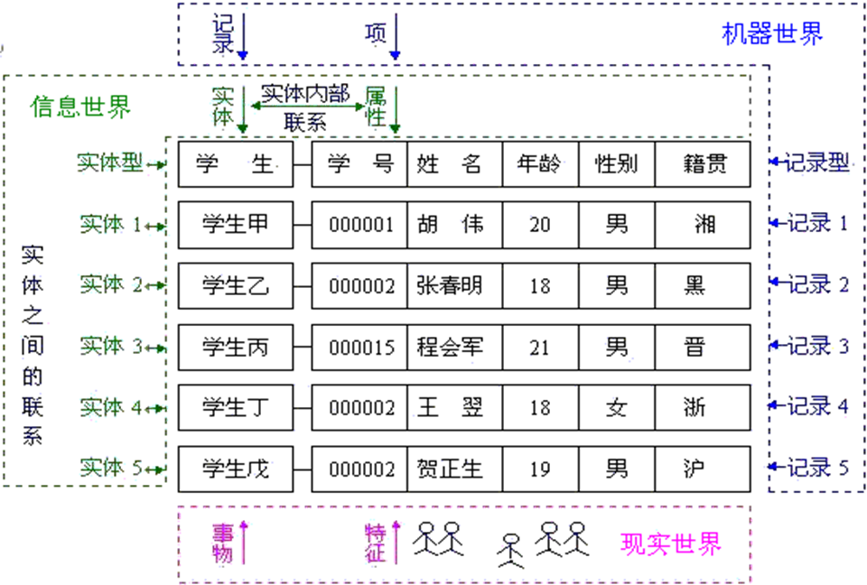
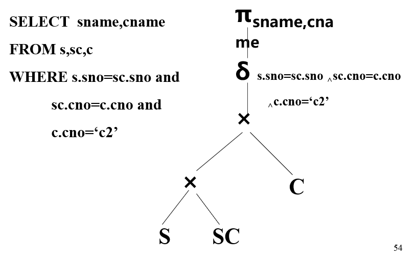

## 第一章（数据库系统概述）

### 基本概念

| 名词           | 概念                                                         |
| -------------- | ------------------------------------------------------------ |
| 数据           | 描述事物的符号称为数据，数据是数据库中存储的基本对象         |
| 数据库         | **长期存放在计算机内、有组织的、可共享的**数据集合。数据库中的数据按一定的数据模型组织、描述和存储，且具有**较小的冗余度、较高的数据独立性和易扩展性**，并可为多个用户共享 |
| 数据库管理系统 | 用于建立、使用和维护数据库的**软件**：<br />- 建立：如何定义、组织和存储数据<br />- 使用：增删改查<br />- 维护：保证数据安全性、完整性 |
| 数据库系统     | 采用了数据库技术的计算机系统，包括DB、DBMS、开发工具、应用系统、硬件、软件、用户和DBA（**就是最大的，包含人的**） |

- 数据处理

  是对各种形式的数据进行收集、储存、加工和传播的一系列活动的总和

- 数据管理

  是指数据的分类、组织、编码、存储、维护、检索等操作，**是数据处理的核心**（数据库技术是数据管理的高级技术）


### 数据库管理的发展阶段

1. 人工管理

   | 数据长期保存 | 管理数据     | 数据具有独立性 | 数据共享 |
   | ------------ | ------------ | -------------- | -------- |
   | ×            | 应用程序管理 | ×              | ×        |

2. 文件系统

   | 数据长期保存 | 管理数据     | 数据具有独立性 | 数据共享 |
   | ------------ | ------------ | -------------- | -------- |
   | √            | 文件系统管理 | ×              | ×        |

3. 数据库系统

   | 数据结构化 | 管理数据     | 数据具有独立性 | 数据共享 |
   | ---------- | ------------ | -------------- | -------- |
   | √          | DBMS统一管理 | √              | √        |

   - 数据库系统实现了整体数据结构化
   - **数据之间是具有联系的**
   - 最小单位可以到**数据项**

4. 高级数据库技术

   分布式数据库、面向对象数据库、XML数据库、图数据库


### 数据模型

- 模型：模型是现实世界**特征的模拟和抽象**
- 数据模型：也是一种模型，是现实世界**数据特征的抽象**
- 信息世界术语



一行就是一个记录（一个实体）

这几行全算进去就是一个实体集

属性是某个特征

实体标识符是主键

实体型：如 → 学生（学号，姓名）

域是属性的取值范围（所有属性构成的集合）

联系：实体内部的联系（属性间）、实体之间的联系（不同实体集）

- **实体集之间的联系**
  1. 一对一联系（1 : 1）
  2. 一对多联系（1 : n）
  3. 多对多联系（m : n）

- ER模型：实体、属性、联系

- 逻辑数据模型：数据结构、数据操作、数据完整性约束

  1. 层次数据模型（**树型**）

     给定的记录值只有按路径查看时才能显示全部意义，适合一对多，若要表示多对多则要分解成多个一对多

     - 优点：查询效率高、完整性支持
     - 缺点：只能一对多，多对多会数据冗余，编程复杂，插入删除限制多，查询必须从双亲

  2. 网状数据模型（**有向图**）

     适合多对多，支持码的概念，保证双亲记录和子女记录之间是一对多（多对多要引入联结记录）

     - 优点：两个结点间可有两种或多种联系，使用指针，存取查询效率高
     - 缺点：结构复杂，编程复杂

  3. 关系数据模型（**二维表**）

     关系：一张表
     元组：一行
     属性：一列
     主码：某个属性组，可以唯一确定一个元组（确定一行）
     域：属性的取值范围
     关系模式：二维表表头一行

     - 优点：结构简单，存取路径透明，有更高的数据独立性，更好的安全保密性
     - 缺点：查询效率不如其它高

     **关系数据模型和层次、网状数据模型最大的差别是：用关键码而不是指针导航数据**


### 数据库系统结构

三级模式结构，提供两级映象功能

- 概念

  1. 型：对某一类数据的**结构和属性**的说明
  2. 值：是型的一个具体赋值
  3. 模式：全体数据的逻辑结构和特征，反映数据的结构及其联系
  4. 实例：模式的一个具体值，反映数据库某一时刻的状态，同一模式有很多实例

- **三级模式**

  1. 外部级（外模式）（用户模式）

     又称用户视图，是用户看到和使用的**局部数据的逻辑结构和特征的描述**，与某一**应用有关的数据**的逻辑表示

     用户所有操作都是针对用户视图进行

     **外模式是模式的子集**

     每个用户必须使用一个外模式，一个外模式可以有数个不同的用户使用，**一个应用程序只能使用一个外模式**

     - 优点：接口简单方便、保证数据独立、增强数据保密性（用户只能看到对应外模式的数据，其余数据不可见）

  2. 概念级（模式）（逻辑模式）

     所有用户的公共数据视图（**全局的数据视图**），是**数据库管理员**看到和使用的数据库

     模式是**全部数据的逻辑结构和特征**的描述，描述概念记录类型，记录间的联系、操作、完整性、安全性等

     **一个数据库只有一个模式！**

  3. 内部级（内模式）（存储模式）

     是数据**物理结构和存储方式**的描述

     **一个数据库只有一个内模式！**

- **两级映象**

  两级映像保证数据库系统的数据具有较高**逻辑独立性**和**物理独立性**

  1. 模式 / 内模式映象

     **全局逻辑结构与存储结构**之间的对应关系

     **模式 / 内模式映象是唯一的！**一般在模式中描述

  2. 外模式 / 模式映象

     **每一个外模式，数据库系统都有一个外模式 / 模式映象**一般在外模式中描述！

  三个抽象级间通过两级映象进行相互转换，使得数据库的三级形成一个统一整体，**保证了数据的独立性——逻辑独立性、物理独立性**（只应用程序与数据间相互独立、不受影响）

  - 物理独立性

    如果内模式（存储结构）要进行修改，那么对模式 / 内模式映象进行修改，**使模式尽可能保持不变**

  - 逻辑独立性

    如果模式要进行修改，那么对每个外模式 / 模式映象也要修改，**使外模式尽可能保持不变**

  **总的来说，不改应用程序！保证外模式的稳定性**


## 第二章（关系数据库）

### 关系数据结构及形式化定义

- 笛卡尔积：把所有可能的情况列出来

- **键（码）**

  1. 候选键（码）：关系中的某一属性组的值能唯一标识一个元组，而其子集不能，该属性组为候选键（**是一个最小范畴，如姓名能标识一个班级的人，学号也可以，那这俩都是候选键**）
  2. 主键（主码）：多个候选键中的一个
  3. 外键（外码）：R的某一个或一组属性**不是本身的码（候选键）**，而是另一关系S的主码，则该属性是R的外键

- **属性**

  1. 主属性：候选码的诸属性
  2. 非主属性：不包含在任何候选码中的属性
  3. 全码：关系模式的所有属性构成候选码（只有全选，才能知道）

  **候选码由主属性构成，但主属性不一定是候选码**

- 关系模式是静态的（型），关系是关系模式某一时刻的状态，是动态的（值）


### 关系的完整性

- 实体完整性

  基本关系R的主属性不能取空值

- 参照完整性

  定义主 - 外码之间的引用规则

  1. 外键的值或为空，或为对应的某个主键值
  2. 主键所在关系是被参照关系，外键所在关系为参照关系

- 用户定义的完整性

  

### 关系代数

- 选择

  从现有关系中选择满足一定条件的元组组成新的关系（行运算）

  

- 投影

  从现有关系中选取某些属性组成新的关系（列运算）（去掉重复的！）

  

- 连接

  从两个关系的**笛卡尔积中**选取属性间满足一定条件的元组

  

- 等值连接

  所有公式中的运算符都为 = 号

- 自然连接

  是特殊的**等值连接**，要求进行比较的分量是**相同的属性组**，并且去掉重复的属性列（若两个关系没有公共属性，则自然连接相当于笛卡尔积）

  

- 除法（÷）

  在选定属性值的情况下，筛选出对应拥有这些所有属性值的表（**关键词：所有、至少**）

  


### 外联接

自然连接只保留找得到的所有信息，而外连接将找不到的信息填充为NULL

若R和S做自然连接

- 左外连接：R中缺省的信息填入NULL
- 右外连接：S中缺省的信息填入NULL


## 第三章（关系数据库标准语言SQL）

- 数据定义语言（DDL）
  $$
  CREATE/DROP
  \begin{cases}
  SCHEMA\\
  TABLE\\
  VIEW\\
  INDEX\\
  \end{cases}
  $$
  
- 查询语言（QL）

  SELECT...FROM...WHERE...

- 数据操纵语言（DML）

  INSERT、UPDATE、DELETE

- 数据控制语言（DCL）

  GRANT、REVOKE、COMMIT、ROLLBACK

- 基本数据类型

  int、smallint、numeric(p, d)（定点数，共p位，不包括小数点，右边d位）、real、double、float(n)（精度至少n位数）

  char(n)、varchar(n)（最大长度为n的可变长字符串）

  date、time

- 建表

  ```sql
  CREATE TABLE SC
    (SNO	CHAR(4),
     CNO  CHAR(4),
     G	SMALLINT,
     
     PRIMARY KEY (SNO,CNO),
     FOREIGN KEY(SNO) REFERENCES S(SNO),
     FOREIGN KEY(CNO) REFERENCES C(CNO),
     CHECK ((G IS NULL) OR (G BETWEEN 0 AND 100))
  　);
  ```

- 对表增加列、修改列定义

  ```sql
  ALTER TABLE S ADD ADDR CHAR(20);
  ALTER TABLE S ALTER COLUMN age int;
  ```

- 对表增加、删除完整性约束条件
  ```sql
  ALTER TABLE C ADD UNIQUE (CN);   
  ALTER TABLE C DROP <完整性约束名>;
  ```
  
  **RESTRICT**：如存在依赖该表的对象（视图、索引、触发器、存储过程、约束等），此表不能被删除
  
  **CASCADE**：删除该表的同时，相关的依赖对象被同时删除
  
- 创建索引

  ```sql
  # 唯一索引
  CREATE UNIQUE INDEX ST ON S(SNO ASC, CNO DESC);
  # 聚簇索引
  CREATE CLUSTER INDEX Stusname ON Student(Sname);
  ```

- 查询语句

  ```sql
  SELECT [DISTINCT] 列表达式[,列表达式]
  FROM 表名或视图名 [，表名或视图名]… 
  [WHERE 条件表达式] (条件子句)
  [GROUP BY 列名1] (分组子句)
  [HAVING 组条件表达式] (组条件子句)
  [ORDER BY 列名2[ASC|DESC]..] (排序子句) 
  ```

  通配符："_"代表一个字符，"%"代表多个，转义用"\\"和"ESCAPE '\\' "

- 集合函数

  ```sql
  # count
  count([distinct]<列名>)：
  # sum计算一列的总和(此列必须是数值型) 
  sum([distinct]<列名>)
  # avg计算一列的平均值(此列必须是数值型)
  avg([distinct]<列名>)
  # max求一列值中的最大值
  max([distinct]<列名>)
  # min求一列值中的最小值
  min([distinct]<列名>)
  # 除count(*)外，都跳过空值而只处理非空值。
  ```

- 对查询结果分组

  ```sql
  select sno
  from sc
  group by sno
  having count(cno)>3
  ```

  - **WHERE**子句作用于基本表或视图，从中选择满足条件的元组

  - **GROUP BY**对WHERE的结果进行分组

  - **HAVING**子句作用于组，从中选择满足条件的组，即对分组数据进一步筛选

  **如果使用了分组子句，则查询列表中的每个列要么是分组依据列（GROUP BY），要么是聚集函数**

- 带有any或all谓词的子查询

  ```sql
  # any
  select sno,sname from s
  where sno = any(
      select sno
      from sc
      where cno=‘c2’);
  
  # all
  select sname,age
  from s
  where sex=’男’ and 
        age < all(select age 
                  from s 
                  where sex=‘女’);
  ```

- exists可以理解为"存在于"，后面接一个子查询


## 第六章（关系的规范化设计）

### 函数依赖

反映属性或属性组之间相互依存，互相制约的关系，即反映现实世界的约束关系

**一个决定另一个？**

X Y如果是1 : 1，那么X → Y、Y → X

X Y如果是M : 1，那么X → Y

1. **完全函数依赖和部分函数依赖**

   - 完全函数依赖：最小的决定关系X → Y

   - 部分函数依赖：真子集可以完全函数依赖（带了些不相关的属性）

     如（学号，姓名）→ 班级。实际上学号就能决定班级

2. **平凡函数依赖和非平凡函数依赖**

   - 平凡函数依赖：Y包含于X，X → Y
   - 非平凡函数依赖：Y不包含于X，X → Y


### 范式

1. 第一范式

   能放进数据库的都符合第一范式

2. 第二范式

   非主属性完全函数依赖于码

   **码可以作为最小属性组推出其余属性**

3. 第三范式

   **非主属性（不包含在！任何！候选码中的属性）不传递函数依赖于任何一个候选码**

   候选码 → 某非主属性1 → 某非主属性2，就不是第三范式

   没有非主属性也是3NF

4. BC范式

   每个非平凡函数依赖，决定方一定含候选码（不存在非主属性决定非主属性）


## 第七章（数据库设计）

1. 规划阶段

   必要性及可行性分析，输出可行性分析报告

2. 需求分析阶段

   调查研究了解用户的要求，输出数据流程图和数据字典

3. 概念设计阶段

   输出ER图

4. 逻辑设计阶段

   输出关系模式

5. 物理设计阶段

   输出物理设计说明书

6. 数据库实施阶段

   输出程序代码

7. 运行维护阶段

   输出维护报告


## 第八章（数据库编程）

### 存储过程

```sql
DELIMITER ;;
CREATE DEFINER=`root`@`localhost` PROCEDURE `update_me_allprices`()
BEGIN
	#Routine body goes here...
	UPDATE me SET me.`价格` = (
	SELECT `价格` FROM menu
	WHERE me.`菜名` = menu.`菜名`
	) * me.`份数`;

END
;;
DELIMITER ;
```


### 触发器

```sql
DELIMITER ;;
CREATE TRIGGER `after_menu_insert` AFTER INSERT ON `menu` FOR EACH ROW if (new.菜名 like '*%') then
INSERT INTO `me` (`菜名`, `份数`, `价格`) 
VALUES (new.菜名, 1, new.价格);
end if
;;
DELIMITER ;
```


## 第九章（查询优化）

### 代数优化

- 如何从SQL语句生成原始查询树（暴力连接表）

  1. SELECT → 投影
  2. FROM → 笛卡尔积
  3. WHERE → 选择

  

- **启发式规则（优化）**

  1. 选择运算尽可能先做（最重要、最基本）
  2. 投影运算和选择运算同时进行
  3. 把投影同其前或后的双目运算结合起来
  4. 某些选择和前面的笛卡尔积结合变成连接运算
  5. 找出公共子表达式

  > ##### 一个例子
  >
  > ```sql
  > SELECT s#,sn
  > FROM s,sc,c
  > WHERE t='LIU' and		# F1
  > 	  sex='女' and		# F2 		
  >       s.s#=sc.s# and 	# F3
  >       sc.c#=c.c#		# F4
  > ```
  >
  > - 优化前
  >
  >   
  >
  > - 第一步，将选择条件移向叶子端点（先选择，减小范围）
  >
  >   
  >
  > - 第二步，在联接前先投影，将无关属性去掉
  >
  >   
  >
  > - 第三步，用联接操作代替笛卡尔积（去掉不必要的重复）
  >
  >   
  >
  > - 第四步，分组
  >
  >   


## 第十章（数据库恢复技术）

### 事务的性质

- 原子性：不可分割
- 一致性：数据不会因事务的执行而遭受破坏
- 隔离性：并发执行要和先后单独执行时结果一样
- 永久性：全部操作提交后，事务对数据库的所有更新永久反映在数据库中

ACID性质，atomic，consistent，isolated，durable


### 系统故障的恢复步骤

1. 正向扫描日志文件（即从头扫描日志文件）

   - 重做(REDO)队列：在故障发生前已经提交的事务

   - 撤销 (UNDO)队列： 故障发生时尚未完成的事务

2. 对撤销队列事务进行撤销处理

   - 反向扫描日志文件，对每个UNDO事务的更新操作执行逆操作

3. 对重做队列事务进行重做处理

   - 正向扫描日志文件，对每个REDO事务重新执行登记的操作

**因为之前提交的事务可能因为值被后面做了一半的事务改了，而产生错误，所以要重做**


### 检查点


## 第十一章（并发控制）

### 并发带来的数据不一致性

1. 丢失修改：同读一数据，先后修改，先修改的丢失

2. 不可重复读：先读一次，另一事务更新提交，再读一次，不一样了

   幻读（也算作不可重复读）：另一事务的更新是删除或插入了数据
3. 脏读：先修改一次，另一事务读一次，修改被**撤销**了，另一事务再读一次，读到的就是脏数据
   


### 并发技术

1. 封锁

   在对某个数据对象操作前，先加锁

   - 排它锁（Exclusive，X锁，写锁）

     **不允许其它事务读取和修改**

   - 共享锁（Share，S锁，读锁）

     加了S锁就不能再加X锁，**保证其它事务可以读A，但是不能做修改**

   

2. 活锁和死锁

   - 活锁

     别人一直轮流锁一个，导致某人一直等待

     解决办法：先来先服务

   - 死锁

     两个或多个事务都已封锁了一些数据对象，然后又都**请求对已被其他事务封锁的数据对象加锁**，从而出现死等待

     解决办法：预防

     1. 一次封锁法：把要用的数据全部加锁，否则不执行（降低了并发度）
     2. 顺序封锁法：规定一个封锁顺序（难以实现）、

     诊断与解除

     1. 超时法：超出时限就认为死锁

     2. 事务等待图法：有向图T~1~等T~2~，那么T~1~指向T~2~，判断是否有环

        


### 可串行化调度

多个事务的并发执行是正确的，当且仅当其结果与按**某一次序串行**地执行这些事务时的结果相同

一个调度Sc在保证冲突操作的次序不变的情况下，通过**交换两个事务不冲突操作的次序**得到另一个调度Sc’，如果Sc’是串行的，称调度Sc为冲突可串行化的调度


### 两段锁协议

指所有事务必须分两个阶段对数据项加锁和解锁

