# 计算机网络概述

- 计算机网络就是互连的、自治的计算机集合

  >自治：无主从关系
  >
  >互连：互联互通（通过通信链路、交换网络）
  >
  >交换节点：路由器或交换机

- **数据交换**

  引入许多交换设备，让主机与其连接

  1. 动态转接：在端口之间进行转接（可以并行）
  2. 动态分配传输资源

- **电路交换、报文交换、分组交换**

  1. 电路交换**（独占资源）**

     最典型：电话网络

     建立连接、通信、释放连接

     **多路复用**可以用于共享中继线。频分、时分、波分、码分多路复用

  2. 报文交换

     以整个报文作为一个整体，一次性发送（电报）

  3. 分组交换

     拆分报文成许多小的数据包，再加上头部信息，因此会产生额外开销（但很小，并不会慢）

     统计多路复用：按需共享


# 应用层

## 网络应用的体系结构

- 客户机/服务器结构（C/S）

  1. 服务器
     - 永久提供服务
     - 永久性访问地址/域名
     - 使用大量服务器实现其可扩展性
  2. 客户机
     - 与服务器通信，使用服务器提供的服务
     - 间歇性接入网络
     - 可能使用动态IP地址
     - 不会与其它客户机直接通信

- 点对点结构（P2P）

  - 没有永远在线的服务器
  - 任意端系统/结点之间可以直接通讯
  - 结点间歇性接入网络
  - 结点可能改变IP地址

  **高度可伸缩但难于管理**

- 混合结构（Hybrid，上面两个混合）

  - Napster：文件传输使用P2P，文件搜索使用C/S


## 网络应用进程通信


# 网络层

## 虚电路与数据报网络

网络层把传输层提供的报文进行封装，封装到数据报传输，传输到目的主机后，目的端的网络层再把需要的数据提取出来，**网络层不再是一个端到端的层次**，所以每一个主机和路由器都运行网络层协议

- 转发，将分组从路由器的输入端口转移到合适的输出端口

  每一个路由器有一个转发表，记录什么地址对应什么输出链路

- 路由，确定分组从源到目的经过的路径，依靠路由算法（协议）

- 连接建立（某些网络的重要功能），路径上所有设备都要参与连接的建立

  1. 网络层连接：两个主机之间（路径上的路由器等网络设备参与其中），**网络核心实现是核心**
  2. 传输层连接：两个应用进程之间（端到端）（对中间网络设备透明）

- 虚电路网络

  一条从源主机到目的主机，类似于电路的路径（逻辑连接）

  1. 分组交换
  2. **每个分组**的传输利用链路的**全部带宽**（和电路交换不一样）
  3. 源到目的的路径经过的网络层设备**共同完成虚电路功能**

  虚电路传输分组时，每个分组携带虚电路的标识（VCID）

  **优点：**集成电路交换和分组交换

  **实现：**沿路每个网络设备（如路由器），利用**转发表**记录经过的每条虚电路（同一条VC在每段链路上的VCID通常不同）

- 数据报网络

  网络层无连接，每个分组携带目的地址，路由器根据分组的目的地址转发分组

  1. 基于路由协议/算法构建转发表
  2. 检索转发表
  3. 每个分组独立选路

  因为IP地址太多了，转发表保存的是**目的地址范围对应输出链路**，就有了**最长公共前缀匹配**

| Internet（数据报网络）                       | ATM（VC网络）                                                |
| -------------------------------------------- | ------------------------------------------------------------ |
| 数据交换弹性服务，没有严格时间需求           | 电话网络演化而来，核心业务是实时对话，有严格时间、可靠性需求 |
| 链路类型众多，特点、性能各异，统一服务困难   | 需要有保障的服务                                             |
| “智能”端系统：可以自适应、性能控制、差错回复 | “哑”端系统：电话机、传真机                                   |
| **简化网络，复杂“边缘”**                     | **简化“边缘”，复杂网络**                                     |


## IP数据报

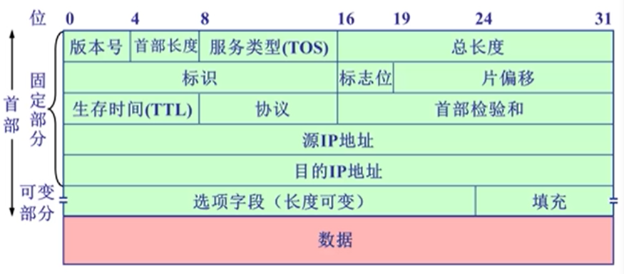

- 版本号：IPV4和IPV6

- 首部长度：**以4字节（32位）为单位**，首部长度为5那么首部长度为20（5x4字节）

- 服务类型（TOS，后改为区分服务）：指示期望得到哪种类型的服务，**只有在网络提供区分服务时使用**，一般情况下都不使用

- 总长度：IP分组的总字节数（首部 + 数据）

  > - 最大IP分组总长度：65535B（理论上，实际会切分）
  > - 最小IP分组首部：20B
  > - IP分组可以封装的最大数据：65535 - 20 = 65515B

- 生存时间（TTL）：在网络中可以通过的路由器数，路由器每转发一次分组，TTL（time to live）减一，如果TTL = 0，则丢弃该分组

- 协议：指示IP分组封装的是哪个协议的数据包，实现复用/分解

- 首部校验和：对IP分组首部的差错检测，UDP的方法（反码算数运算求和），**逐跳计算**

  > 二进制加，进位挪到最后再加，最后取反码，1就没错

- 源IP地址、目的IP地址：各32位，标识路由器IP地址

- 选项（1~40B）：携带安全、源选路径、时间戳、路由记录等（实际很少被使用）
- 填充（0~3B）：补齐首部，符合32位对齐

---

- 标识（ID）：IP协议利用一个计数器，每产生IP分组计数器加一，作为该IP分组的标识（与源、目的IP地址等共同确定分组顺序）

- 标志位（3位）：每个字节分别为**保留、DF、MF**

  > 保留：没有定义
  >
  > DF: Don't Fragment，禁止分片
  >
  > - DF = 1，禁止分片
  > - DF = 0，允许分片
  >
  > MF: More Fragment，更多片
  >
  > - MF = 1，非最后一片
  > - MF = 0，最后一片（或未分片）

- 片偏移（13位）：一个IP分组分片封装原IP分组数据的相对偏移量（没有分片一定是0），**片偏移字段以8字节为单位**，因为总长度16位（标识），这里只有13位

---


## IP分片

- 最大传输单元（MTU）：IP分组需要封装在链路层的数据帧里，不同数据帧对封装的数据是有限制的，**不同链路MTU不同**

  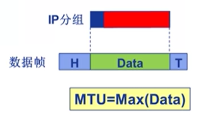

  如果从较大MTU传输到较小MTU怎么办呢？

- 分片：大IP分组向较小MTU链路转发时，**可以**执行分组

  1. 一个IP分组分为多片IP分组
  2. IP分片到达**目的主机后**进行重组（路由器只分不装）

  IP首部相关字段用于标识分片及其相对顺序（如果目的主机没收全，等待一会儿会全部扔掉）

  > #### 分片过程
  >
  > 1. 假设原IP分组总长度为L，待转发链路的MTU为M
  >
  > 2. 若L > M，且DF = 0，则可以/需要分片
  >
  > 3. 分片时每个分片的标识复制原IP分组的标识
  >
  > 4. 通常，分片时，除最后一个分片，其它分片均分为MTU允许的最大分片
  >
  > 5. 一个最大分片可封装的数据应该是8的倍数，因此，一个最大分片可封装的数据大小为：
  >    $$
  >    d = \lfloor \frac{M-20}{8} \rfloor × 8
  >    $$
  >    其中，20是最小首部大小，取整是为了32位字节对齐
  >
  > 6. 需要的总片数为：
  >    $$
  >    n = \lceil \frac{L - 20}{d} \rceil
  >    $$
  >    
  > 7. 每片的片偏移字段**（以8字节为单位）**为：
  >    $$
  >    F_i = \frac{d}{8} × (i - 1),\quad 1 \leq i \leq n
  >    $$
  >
  > 8. 每片的总长度字段为：
  >    $$
  >    L_i = 
  >    \begin{cases}
  >    d \qquad\qquad\qquad 1 \leq i < n \\
  >    L - (n - 1)d \qquad i = n
  >    \end{cases}
  >    $$
  >
  > 9. 每片的MF标志位为：
  >    $$
  >    MF_i = 
  >    \begin{cases}
  >    1 \qquad 1 \le i < n \\
  >    0 \qquad\quad i = n
  >    \end{cases}
  >    $$

  **注意**：如果MTU让分组时的片偏移量产生小数，则会舍弃一部分单元不传输
  
  

## IP编址

- IP分组：源地址（SA），目的地址（DA）

  接口：主机/路由器与物理链路的连接

- 网络编址是实现网络层功能的接口，交换机、wifi接入点的功能实现都在数据链路层

- IP地址：32比特（IPv4）：编号标识主机、路由的接口

  > 点分十进制：类似223.1.1.1的表示方法

  IP地址与每个接口关联

- **IP子网**

  - 把IP地址分为网络号（高位比特）、主机号（低位比特）

  - 在子网中，网络号都是相同的，只有主机号不同，因此也能一一对应

  > #### IP子网特点
  >
  > 1. IP地址具有相同网络号的设备接口
  > 2. **不跨越路由器**（第三及以上层网络设备），可以彼此**物理联通**的接口
  > 3. 所以路由转发表中，直接记录子网网络号（如223.1.1.0/24）

  

## 有类IP地址

- “有类”编址

  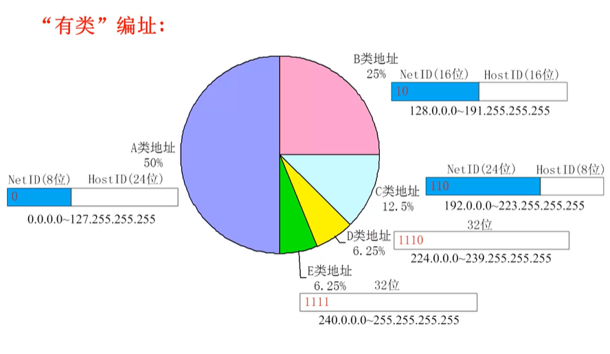

  D类地址用来命名、标识一组主机，这些主机理论上能分布在互联网每一个地方，只能向这类地址发送消息，这类地址叫做多播/组播地址

  E类保留，做研究使用

  ABC类可以确定不同数量的子网数和主机数，其中一些地址有特殊目的，不能使用

  > #### 特殊IP地址
  >
  > 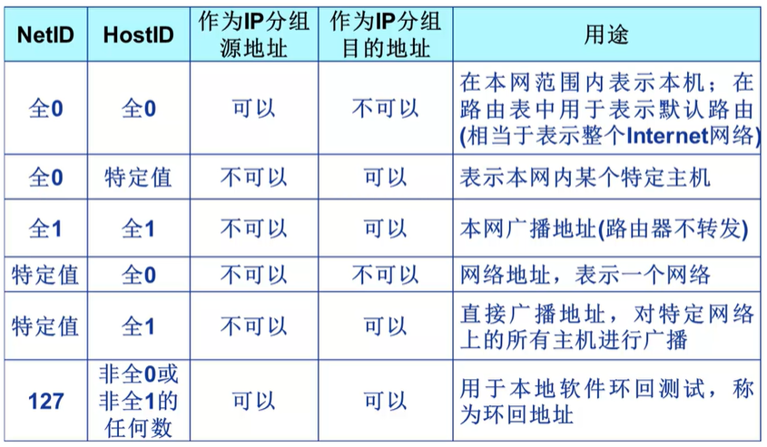
  >
  > 环回地址：发送的IP分组不会离开主机，到了网络层后又回到该主机
  >
  > #### 私有IP地址
  >
  > 只用于内部网络，在公共互联网上是无效的
  >
  > 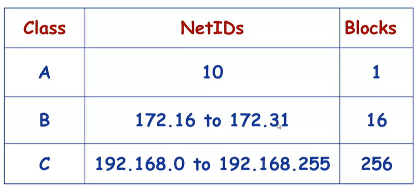


## IP子网划分与子网掩码

有类编址非常不灵活，可能会造成地址浪费

AB类网络太大了，还是需要用路由器，因此需要进行子网划分

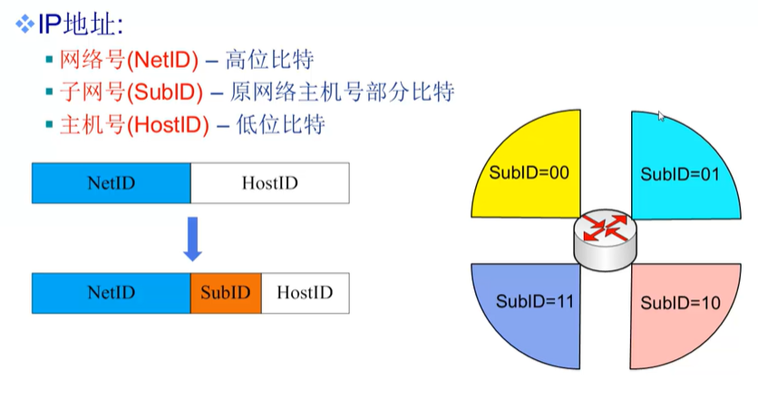

- 子网掩码

  形如IP地址，32位点分十进制形式

  **取值**：NetID、SubID位全取1，HostID位全取0。**子网地址 + 子网掩码 → 准确确定子网大小**

  > #### 对比
  >
  > 子网地址：网络号、子网号是特定值，主机号是0
  >
  > 子网掩码：网络号、子网号都是1，主机号是0
  >
  > **例子**：
  >
  > > 将子网201.2.3.0，255.255.255.0划分为等长的4个子网
  > >
  > > | 第i段 | 子网地址    | 子网掩码        |
  > > | ----- | ----------- | --------------- |
  > > | 1     | 201.2.3.0   | 255.255.255.192 |
  > > | 2     | 201.2.3.64  | 255.255.255.192 |
  > > | 3     | 201.2.3.128 | 255.255.255.192 |
  > > | 4     | 201.2.3.192 | 255.255.255.192 |
  > >
  > > 其实就相当于，**用两位作子网号，00、01、10、11实现平均分，子网掩码相同是因为它就是个标识**

  **总结**：子网地址就是具体的地址，子网掩码是划分各个含义的标识符

- 子网掩码的应用

  ★ 路由器将目的IP地址和子网掩码做**按位与**运算，就可以提取出子网地址，就能判断该IP地址是否属于某子网

  有了子网地址，也就能确定子网的**地址范围**了

  可分配地址范围：地址范围中去除不能分配的特殊地址


## CIDR与路由聚合

有类地址分配路由效率低

- 无类域间路由（CIDR，Classes InterDomain Routing）

  1. 消除传统的ABC类地址界限，网络前缀（非主机号）可以是任意长度
  2. 融合子网地址与子网掩码，方便子网划分（a.b.c.d/x）
  3. 提高了IPv4地址空间分配效率（不浪费）
  4. 提高路由效率：将多个子网聚合为一个较大的子网（路由聚合），**省了路由器转发表的空间**

  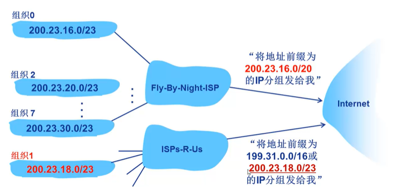

  **最长前缀匹配优先**避免因地址不连续产生黑洞现象


## DHCP协议

- 如何获得IP地址？

  1. 硬编码（静态配置）：IP地址、子网掩码、默认网关（确定送出的默认接口，如下）

     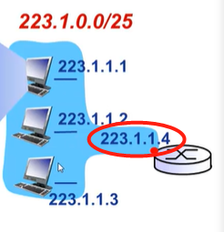

  2. **动态主机配置协议**（DHCP，Dynamic Host Configuration Protocol）

     - 从服务器动态获取IP地址、子网掩码、默认网关地址、DNS服务器名称与IP地址
     - 即插即用
     - 允许地址重用：租用地址进行通信，不用了就还回去
     - 支持移动用户加入网络

     > #### 新到主机如何加入DHCP网络
     >
     > 1. 主机广播“DHCP discover”（发现报文）
     >
     >    因为来的主机不知道这里提不提供DHCP服务，因此先做尝试
     >
     > 2. DHCP服务器利用“DHCP offer”（提供报文）进行响应
     >
     >    如果有DHCP服务器，它也会用广播方式通报告知新到主机能够提供DHCP服务
     >
     > 3. 主机请求IP地址“DHCP request”（请求报文）
     >
     > 4. DHCP服务器分配IP地址“DHCP ack”（确认报文）
     >
     > 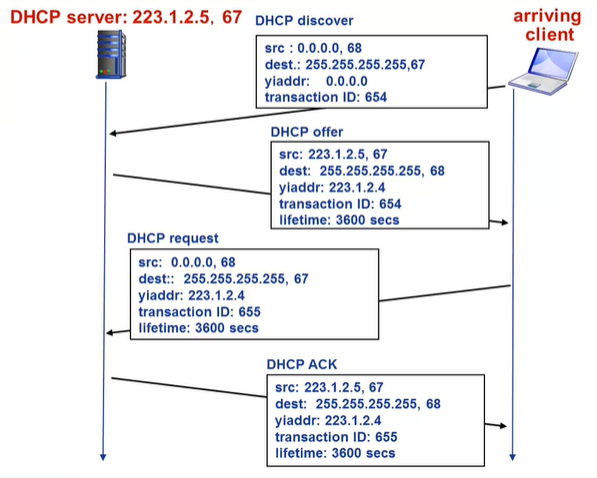
     >
     > **示意图（注意IP地址的变化）**

- DHCP协议在应用层实现

  1. 请求报文封装到UDP数据报中
  2. IP广播
  3. 链路层广播（如以太网广播）
  4. 构造ACK报文（包括分配给客户的IP地址、子网掩码、默认网关、DNS服务器地址）


## 网络地址转换（NAT）

私有地址不能在公共互联网被识别，因此需要转换

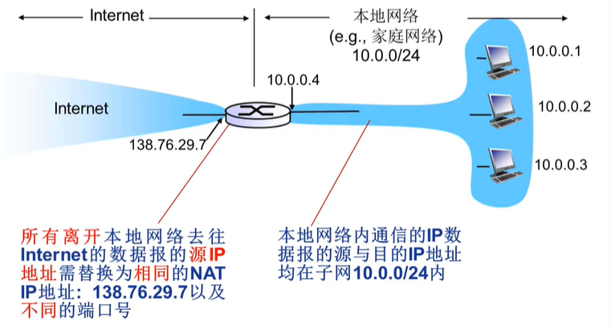

- 动机

  1. 只需/能从ISP申请一个IP地址（IPv4地址耗尽）
  2. 本地网络设备IP地址的变更，无需通告外界网络
  3. 变更ISP时，无需修改内部网络设备IP地址
  4. 内部网络设备对外界网络不可见，即不可直接寻址（安全）

- 实现

  1. **替换**：利用（NAT IP地址、新端口号）替换每个外出IP数据报的（源IP地址、端口号）
  2. **记录**：将每对（NAT IP地址、新端口号）与（源IP地址、端口号）的替换信息存储到NAT转换表中
  3. **替换**：根据NAT转换表，再将进入内网IP数据报的（目的IP地址、目的端口号）替换为（源IP地址、端口号）

  **就是WAN（如138.76.29.7，5001）和LAN（如10.1.0.1，3345）建立一一映射，并且存起来**

  WAN: Wide Area Network：广域网

  LAN: Local Area Network：局域网

  16-bit端口号字段：可以同时支持60000+并行连接

- 争议

  1. 路由器应该只处理第3层功能，不该把第4层封装好的数据包还拿出来修改
  2. 违背端到端通信原则（应用开发者必须考虑到NAT的存在，如P2P应用）
  3. 地址短缺问题应用IPv6来解决

- 问题（NAT穿透问题）

  1. 客户期望连接内网地址为10.0.0.1的服务器

     - 客户不能直接利用地址10.0.0.1直接访问服务器（看不见）
     - 对外唯一可见的地址是NAT地址（交互的地方）

     > #### 解决方案
     >
     > 1. 静态配置NAT，将特定端口的连接请求转发给服务器（如138.76.29.7，250）总是转发给（10.0.0.1，25000）
     > 2. 利用UPnP（Universal Plug and Play）互联网网关设备协议自动配置：
     >    - 学习到NAT公共IP地址
     >    - 在NAT转换表中，增删端口映射
     > 3. 中继（如Skype）
     >    - NAT内部的客户与中继服务器建立连接
     >    - 外部客户也与中继服务器建立连接
     >    - 中继服务器**桥接**两个连接的分组


## 互联网控制报文协议（ICMP协议）

IP数据报传输会出差错，ICMP向发送该报文的源主机发送一条ICMP报文

主要功能：支持主机或路由器差错（或异常）报告、网络探寻

- 两类报文

  1. 差错报告报文：目的不可达、源抑制（路由器缓存满，希望源主机降低发送速率）、超时/超期（TTL，寿命）、参数问题、重定向（发错路由器了）
  2. 网络探寻报文：回声请求与应答报文（ping）、时间戳请求与应答报文

- 不发送ICMP差错报告报文的特殊情况

  1. 对ICMP差错报告报文不再发送
  2. 除第一个IP数据报分片外，对所有后续分片均不发送
  3. 对所有多播IP数据报均不发送
  4. 对具有特殊地址（127.0.0.0或0.0.0.0）的IP数据报不发送

- 几种ICMP报文现在已经不再使用

  信息请求与应答报文、子网掩码请求和应答报文、路由器询问和通告报文

- 格式

  ICMP报文封装到IP数据报中传输

  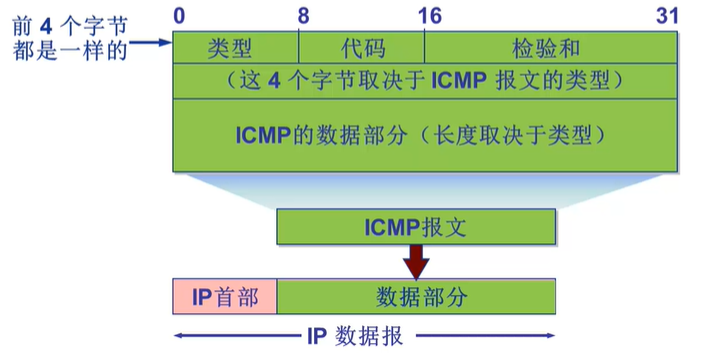

  IP数据报格式

  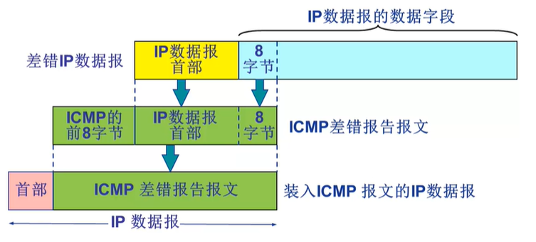

- 应用举例（**Traceroute**）

  1. 源主机向目的主机发送一系列UDP数据报，其中TTL依次递增，且目的端口号为不可能使用的端口号（一次发三个）
  2. 因为TTL，源主机就会收到各路由器发来的ICMP报文；又因为端口不可达，因此也会收到目的主机的ICMP报文
  3. 源主机记录各RTT

  **注：短时期内探寻路径一般不会变化**


## IPv6简介

- 动机

  1. 32位IPv4地址空间已经分配殆尽
  2. 改进首部格式：快速处理/转发数据报、支持QoS（Quality of Service，服务质量）

- 格式

  1. 固定长度40字节基本首部
  2. 不允许分片（如果分片，源主机分）

  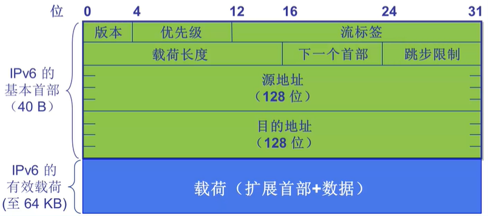

  - 优先级：标识数据报的优先级，区别对待不同类型的数据报（类似于IPv4的TOS）
  - 流标签：标识同一“流”中的数据报（从源主机到目的主机的线路称为流）
  - 下一个首部：标识下一个选项首部或上层协议首部（如TCP首部）
  - 跳步限制：类似IPv4的TTL

  > #### 扩展首部
  >
  > 按以下顺序扩展
  >
  > 逐跳选项报头、目的选项报头、路由选择报头、分段扩展报头、认证扩展报头、封装安全净载报头

- 其它改变（相比IPv4）

  1. 移除校验和，减少每跳处理时间（第2层和第4层中的校验和都已足够强壮，不必考虑对第三层校验和的需求）
  2. 选项：允许，但是从基本首部移除，通过“下一个首部”字段指示
  3. ICMPv6：新版ICMP
     - 附加报文类型（如“Packet Too Big”）
     - 多播组管理功能

- IPv6地址表示形式（128位）

  1. 一般形式：冒号分割16位一组* 8组、16进制
  2. 压缩形式：FF01:0:0:0:0:0:0:43→FF01::43（只能有一次双冒号）
  3. IPv4-嵌入形式：0:0:0:0:0:FFFF:13.1.68.3
  4. 地址前缀：2002:43c:476b::/48
  5. URLs：https://[3FFE::1:800:200C:417A]:8000

- 单播、多播、任意播（一对一组之一【一般是最近一个】通信）
  


## 例题

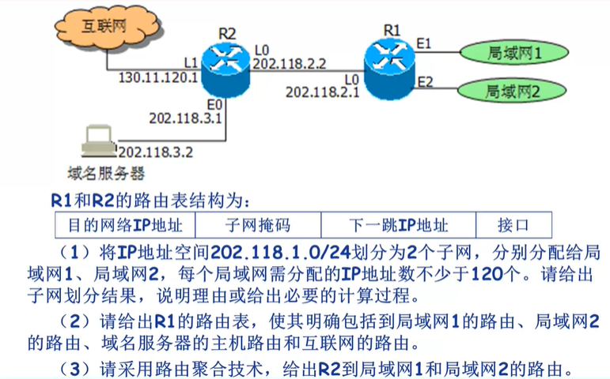

1. 子网1: 202.118.1.0/25

   子网2: 202.118.1.128/25

2. 看清题目，写的是R1的路由表，**互联网的比较特殊，缺省路由，一个都匹配不成功，前面有提到过！**

   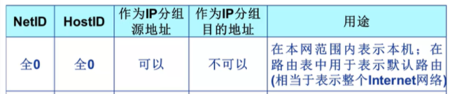

   | 目的网络IP地址 | 子网掩码        | 下一跳IP地址 | 接口 |
   | -------------- | --------------- | ------------ | ---- |
   | 202.118.1.0    | 255.255.255.128 | /            | E1   |
   | 202.118.1.128  | 255.255.255.128 | /            | E2   |
   | 202.118.3.2    | 255.255.255.255 | 202.118.2.2  | L0   |
   | 0.0.0.0        | 0.0.0.0         | 202.118.2.2  | L0   |

3. 如下表所示

   | 目的网络IP地址 | 子网掩码      | 下一跳IP地址 | 接口 |
   | -------------- | ------------- | ------------ | ---- |
   | 202.118.1.0    | 255.255.255.0 | 202.118.2.21 | L0   |


## 路由算法

- 路由算法（协议）确定去往目的网络的最佳路径；转发表确定在本路由器如何转发分组

- 求源到目的的最小费用路径是其中每个路由器都要参与运算的

  1. 静态路由 & 动态路由

     静态路由：手工配置、路由更新慢、**优先级高**

     动态路由（算法计算来的）：路由更新快（定期更新、及时响应链路费用或网络拓扑变化）

  2. 全局信息 & 分散信息

     全局信息：所有路由器掌握完整的网络拓扑和链路费用信息，**如链路状态（LS）路由算法**

     分散信息：路由器只掌握物理相连的邻居以及链路费用，邻居间信息交换、运算的迭代过程，**如距离向量（DV）路由算法**

- **链路状态（LS）路由算法**

  迪杰斯特拉算法，要求所有路由器通过**链路状态广播**掌握网络拓扑和链路费用（所有结点拥有相同信息）

  > #### 迪杰斯特拉算法
  >
  > 1. 选定首个点，把相邻的点距离初始化，其它为正无穷
  > 2. 每次找离选出来的点最近的点加入
  > 3. 新点的所有邻居更新最短路径
  >
  > 得到最短路径树后，存入路由器转发表
  >
  > **注：**存在震荡可能，TTL耗尽后被扔了
  >
  > 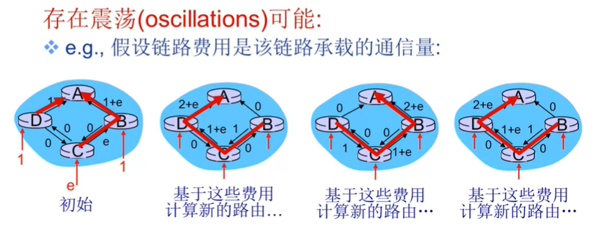

- **距离向量（DV）路由算法**

  Bellman-Ford方程（动态规划）

  根本思想：$d_x(y)=min\{ c(x,v)+d_v(y) \}$，即到邻居的最短路径加上邻居到自己的路径长的最小值

  > #### Bellman-Ford方程
  >
  > 1. x维护到y的最小费用估计（到达目的的最小费用估计，包含到达邻居的费用和邻居的距离向量）
  >
  > 2. 每个结点不定时地将其自身的DV估计发送给邻居
  >
  > 3. 当x接收到邻居的新的DV估计时，即依据B-F更新自身的距离向量估计：
  >
  >    $D_x(y)←min_v\{c(x,v)+D_v(y)\}for\ each\ node\ y∈N$
  >
  > 4. 最小费用估计最终收敛于实际的最小费用
  >
  > 结点获得最短路径的下一跳，存到转发表中
  >
  > > #### 怎么做题？
  > >
  > > 1. 首先只有一个原点知道自己和邻居，其它什么都是无穷
  > > 2. 以该点向外扩散，扩散的点只知道自己和邻居，原点多知道这些信息（每次路径能加一）
  > > 3. 直到无变化
  
  特点：异步迭代、分布式
  
    ```flow
  t1=>operation: 等待（本地局部链路费用变化或者收到邻居的DV更新）
  t2=>operation: 重新计算DV估计
  t3=>operation: 如果DV中到达任一目的距离发生改变，通告所有邻居
  
  t1->t2->t3
    ```
  
  > #### 距离向量路由算法，举例
  >
  > 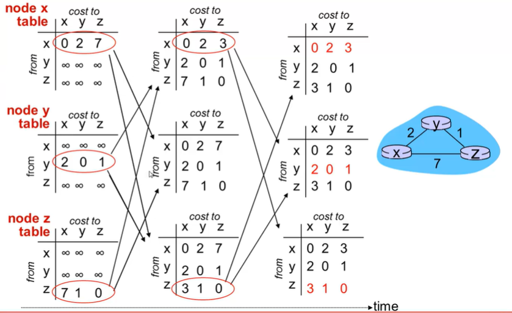
  
  - 如果链路费用变小**（好消息传播快）**
  
    1. 结点检测本地链路费用变化
    2. 更新路由信息，重新计算距离向量
    3. 如果DV改变，通告所有邻居
  
  - 如果链路费用变大**（坏消息传播慢，无穷计数）**
  
    1. 有的结点来不及接收到这个坏消息，由于取小规则的存在，会用原来的较小值计算
    2. 告知给了邻居，邻居也用这个错误的进行运算，并告知回去
    3. 循环很多次，终于对上了
  
    > #### 解决方法
    >
    > 1. 毒性逆转
    >
    >    如果一个结点到达某目的的最小费用路径时通过某个邻居，则通告给该邻居结点到达该目的的距离为无穷大
    >
    > 2. 定义最大度量
    >
    >    定义一个最大的有效费用值，如跳15步，16步表示无穷大
  


## 层次路由

将任意规模网络抽象为一个图计算路由**过于理想化**，大规模网络中不可行

- 聚合路由器为一个区域：自治系统AS（autonomous systems）

  1. 同一AS内的路由器运行相同的路由协议（算法），称为自治系统内部路由协议
  2. 不同自治系统内的路由器可以运行不同的AS内部路由协议

- 网关路由器（自治系统间路由任务）

  1. 位于AS边缘
  2. 通过链路连接其它AS的网关路由器

  **为了将信息传播给正确的网关路由器，子网内路由器必须要知道连接的子网能通向哪些网络，并且让子网内其它路由器也知道这一点**

  > #### 热土豆路由
  >
  > 多AS间选择，转发给哪个网关
  >
  > 1. 通过AS间路由协议学习到：子网x可以通过多个网关到达
  > 2. 利用通过AS内路由协议获得的路由信息确定到达每个网关的最小费用路径的费用
  > 3. 热土豆路由：选择最小费用路径的费用最小的网关
  > 4. 通过转发表，确定去往最小费用网关的接口I，在转发表中增加入口：（x，I）


## RIP协议

- AS（自治系统）内部路由协议也称为内部网络协议IGP（interior gateway protocols）

- 最常见的AS内部路由协议

  1. **路由信息协议**：RIP（Routing Information Protocol）
  2. **开放最短路径优先**：OSPF（Open Shortest Path First）
  3. 内部网关路由协议：IGRP（Interior Gateway Routing Protocol），思科私有协议

- RIP利用的是**距离向量**路由算法

  1. 距离度量：跳步数（max = 15 hops，防止无穷计数），每条链路1个跳步

  2. 每隔30秒，邻居之间交换一次DV，称为通告（advertisement）

  3. 每次通告：最多25个目的子网（IP地址形式，CIDR等）

     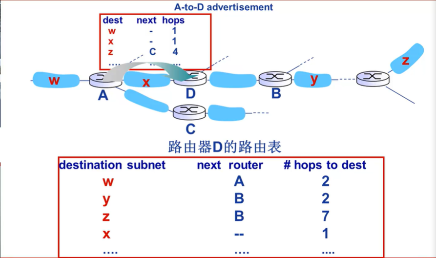

     增加了next可以进行毒性逆转（C看到next是自己，就实现了）

  4. 如果180秒没有收到通告，那么判定邻居/链路失效

     - 经过该邻居的路由不可用（重新计算路由）
     - 向邻居发送新的通告
     - 邻居再依次向外发送通告（如果转发表改变）

     > #### 链路失效信息能否快速传播到全网？
     >
     > 可能发生无穷计数问题，但是问题不大
     >
     > 因为RIP采用了毒性逆转技术，用于预防乒乓环路（无穷大定义为16 hops）

- RIP路由表是利用一个称作route-d（daemon）的**应用层**进程进行管理，通告报文周期性通过UDP数据报发送

  （分层根据实现的功能进行划分）


## OSPF协议

**开放最短路径优先**：OSPF（Open Shortest Path First）

- 特点

  1. 开放：公众可用

  2. 采用**链路状态路由算法**（LS，迪杰斯特拉），每个路由器构造完整的网络（AS）拓扑图

  3. OSPF通告中每个入口对应一个邻居

  4. OSPF通告在整个AS范围泛洪，扩散（OSPF报文直接封装到IP数据报中）

- 优点（RIP不具备）

  1. 安全：所有OSPF报文可以被认证（预防恶意入侵）
  2. 允许使用多条到达相同网络的相同费用的路径（RIP只能选一条）
  3. 对于每条链路，可以针对不同的TOS（服务类型）设置多个不同的费用度量（如，卫星链路可以针对“尽力”，即best effort TOS设置“低”费用；针对实时TOS设置“高”费用）。**实现不同类型分组的分流**
  4. 集成单播路由与多播路由
  5. OSPF支持对大规模AS分层（hierarchical）

- 分层的OSPF

  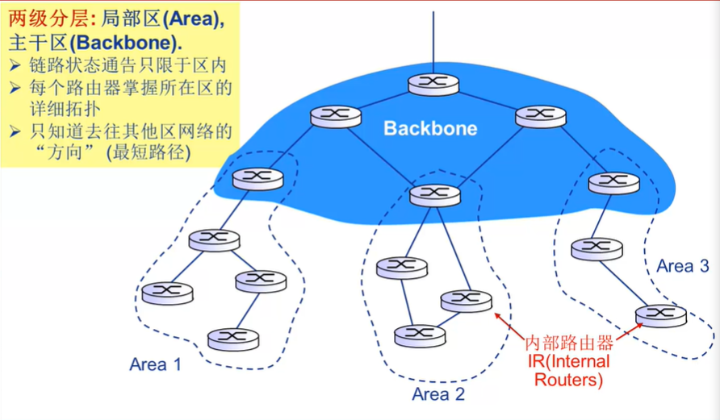

  1. 区边界路由器（Area Border Routers，蓝色最下层）：相当于网关路由器，但是属于主干区，汇总到达所在区网络的举例，通告给其他区边界路由器
  2. 主干路由器（Backbone Router，主干区的其它路由器）：在主干区内运行OSPF路由算法（迪杰斯特拉）
  3. AS边界路由器（AS boundary routers）：连接其它AS，可以有多个


## BGP协议简介

AS间路由协议（Border Gateway Protocol）

- 将Internet粘合为一个整体的关键

- BGP为每个AS提供了一种手段

  1. eBGP：从邻居AS获取子网的可达性信息
  2. iBGP：向所有AS内部路由器传播子网可达性信息
  3. 基于可达性信息与策略，确定到达其它网络的“好”路径（不一定是路径最短、费用最低等）
  4. 容许子网向Internet其余部分通告它的存在

- 基础内容

  1. BGP会话（session）：两个BGP路由器（“Peers”）交换BGP报文

     - 通告去往不同目的前缀（prefix）的路径（路径向量path vector协议）
     - 报文交换基于半永久的TCP连接（也是应用进程实现）

  2. BGP报文

     - OPEN：与peer建立TCP连接，并认证发送方
     - UPDATE：通告新路径（或撤销原路径）
     - KEEPALIVE：在无UPDATE时，保活连接；也用于对OPEN请求的确认
     - NOTIFICATION：报告先前报文的差错；也被用于关闭连接

     当一个子网通告一个前缀给另一个子网时，会承诺可以将数据报转发给该子网，并且在通告中会聚合网络前缀

  3. 分发路径信息

     - 利用eBGP会话给其它子网发送前缀可达性信息
     - 利用iBGP向子网内所有路由器分发新的前缀可达性信息
     - 传播给另一个子网后，子网内路由器可以（也可能不）把该可达性信息传播给另一个子网
     - **当路由器获得新的可达性信息时，在转发表中增加关于该前缀的入口（路由项）**

  4. 路径属性与BGP路由

     - 通告的前缀信息包括BGP属性：前缀 + 属性 = 路由

       AS-PATH（AS路径）：包含前缀通告所经过的AS序列

       NEXT-HOP（下一跳）：开始一个AS-PATH的路由器接口，指向下一跳AS

- BGP路由选择（基于策略的路由）

  1. 网关路由器收到路由通告后，利用其输入策略决策接受/拒绝该路由，如从不将流量路由到AS x
  2. 路由器可能获知到达某AS的多条路由，基于以下准则选择
     - 本地偏好值属性：策略决策
     - 最短AS-PATH（自治系统数少）
     - 最近NEXT-HOP路由器：热土豆路由
     - 附加准则

  > #### 举例
  >
  > 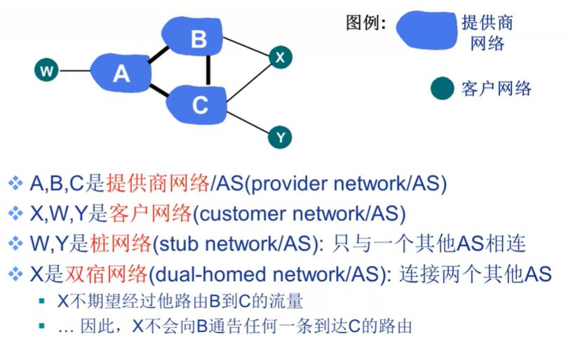
  >
  > 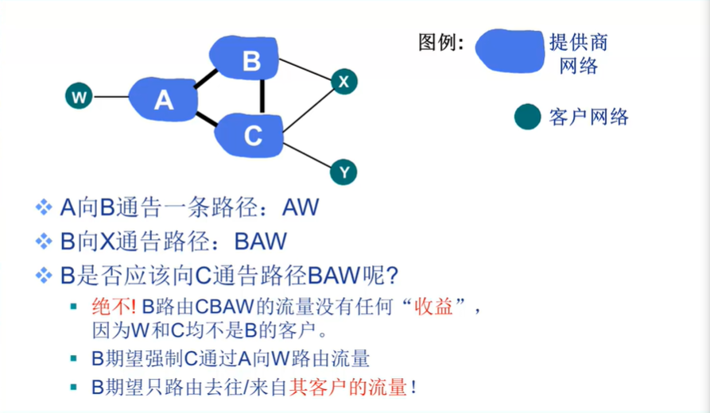
  >
  > 自私

- 为什么采用不同的AS内与AS间路由协议

  1. 策略
     - inter-AS：期望能够管理控制流量如何被路由，谁路由经过其网络等
     - intra-AS：单一管理，无需策略决策
  2. 规模
     - intra-AS：层次路由节省路由表大小，减少路由更新流量
     - inter-AS：适应大规模互联网
  3. 性能
     - intra-AS：侧重性能
     - inter-AS：策略主导


# 链路层

## 数据链路层服务

从数据链路层角度来说，主机和路由器都称为**结点**；
连接相邻结点的通信信道称为**链路**；
链路层数据分组称为**帧**，封装网络层数据报；

数据链路层负责通过一条链路从**一个结点向另一个物理链路直接相连的相邻节点传送数据报**

- 链路层服务

  1. 组帧：封装数据报构成数据帧，加首部和尾部；实现帧同步
  2. 链路接入：如果是共享介质，需要解决信道接入；帧首部中的”MAC“地址，用于标识帧的源和目的
  3. 相邻结点可靠交付：在低误码率的有线链路上很少采用（如光纤，某些双绞线等）；无线链路误码率高，需要可靠交付
  4. 流量控制：协调相邻的发送结点和接收
  5. 差错检测：信号衰减和噪声会引起差错；接收端检测到差错通知发送端重传或丢弃帧
  6. 差错纠正：接收端直接纠正比特差错
  7. 全双工和半双工通信控制：全双工，链路两端结点同时双向传输；半双工，链路两端结点交替双向传输

  

## 差错编码

- 原理

  在数据基础上增加冗余信息（分组码其中一种如下）

  

  **不能保证100%可靠！**

- 差错码分为检错码和纠错码

  1. 对于检错码，如果编码集的汉明距离（所有编码之间不同的比特位数最小值）等于r + 1，则该差错编码可以检测r位的差错
  
     > #### 例
     >
     > 例如编码集{0000, 0101, 1010, 1111}的**汉明距离为2**，可以100%**检测1比特差错**
  
  2. 对于纠错码，如果编码集的汉明距离等于2 * r + 1，则该差错编码可以检测r位的差错
  
     > #### 例
     >
     > 例如编码集{000000, 010101, 101010, 111111}的**汉明距离为3**，可以**纠正1比特纠错**

- 奇偶校验码

  1. 奇校验：让data和校验位中1的个数为奇数

  2. 偶校验：让data和校验位中1的个数为偶数

  3. 缺点：只有奇数个位发生差错能够被检测到；偶数个位发生差错检测不到。所以检测率为50%

  4. 优点：编码效率高

- 二维奇偶校验

  

- 校验和

  数据划为16位的二进制序列，补码求和（最高位进位的1返回最低位继续加），取反码。接收端应该计算出16位全为0，否则就是出错

- 循环冗余校验码（CRC）

  检错能力非常强，利用多项式理论

  1. 将数据比特，D，视为一个二进制数
  2. 选择一个r + 1位的比特模式（生成比特模式），G
  3. 目标：选择r位的CRC比特，R，满足
     - <D, R>刚好可以被G整除（模2）
     - 接收端检错：利用G除<D, R>，余式全0则无错，否则有错
     - 可以检测所有突发长度小于r + 1位的差错
  4. 广泛应用于网络

  > #### 例
  >
  > 
  >
  > 由G的位数r + 1确定左移位数r，再用异或除法（位数一样就能异或了）
  >
  > 注意，其中计算是异或计算


## 多路访问控制（MAC）协议

单一共享广播信道，两个或两个以上结点同时传输，会造成干扰。冲突：结点同时接收到两个或者多个信号，接收失败

- 理想的MAC协议

  1. 当只有一个结点希望传输数据时，可以以速率R发送
  2. 当有M结点发送时，每个结点平均发送速率是R / M
  3. 完全分散控制：无需特定结点协调、无需时钟时隙同步

- MAC协议分类

  1. 信道划分MAC协议：多路复用技术（时分复用、频分复用）（占用率高时效率高，否则效率低）

     

     

  2. 随机访问MAC协议：信道不划分、允许冲突，采用冲突恢复机制

     - 当结点要发送分组时，利用信道全部数据速率R发送分组
     - 没有事先的结点间协调，所以可能产生冲突
     - 所以需要定义：如何检测冲突、如何从冲突中恢复（如通过延迟重传）
     - 典型随机访问MAC协议：时隙ALOHA、ALOHA、CSMA、CSMA/CD、CSMA/CA

  3. 轮转MAC协议：结点轮流使用信道

- **时隙ALOHA**

  1. 假定

     所有帧大小相同，事件被划分为等长的时隙（每个时隙可以传输1帧），结点只能在时隙开始时刻发送帧，结点间时钟同步，如果2个或2个以上结点在同一时隙发送帧则会冲突

  2. 运行

     当结点有新帧，在下一个时隙发送。无冲突可以在下一个时隙发送新帧；有冲突则以概率p发送

     

  3. 优缺点

     - 优点：单个结点活动时以全部速率传输，高度分散只需同步时隙
     - 缺点：易冲突，空闲时隙，结点也许能以远小于分组传输时间检测到冲突，时钟必须同步

  4. 效率**（长期运行时成功发送帧的时隙所占比例）**

     - 对于一个给定结点，在一个时隙发送帧成功的概率：$p(1-p)^{N-1}$
     - 对于任意结点发送成功的概率：$Np(1-p)^{N-1}$
     - 最大效率：求得使该式最大的$p^*$，将其代入式中求N取余无穷时的极限
     - 结果：1 / e = 0.37

- **非时隙（纯）ALOHA**

  没有同步时间。当有新的帧生成时立即发送，冲突可能性增大：在t时刻发送帧，会与在[t - 1, t + 1]期间发送的帧冲突

  1. 效率
     - $p(1-p)^{2(N-1)}$，因为前后两个时隙都不能有发的
     - 结果：1 / 2e = 0.18
  2. 虽然效率低，但是最早使用，有意义加成

- **CSMA协议（载波监听多路访问协议）**

  1. 发送帧之前，监听信道：信道空闲则发送完整帧，忙则推迟发送
  2. 冲突仍然可能发生：如信号传播延迟
  3. 继续发送冲突帧会浪费信道资源

- **CSMA/CD协议（带冲突检测）**

  1. 短时间内检测冲突，冲突后传输中止减少信道浪费
  2. 冲突检测在有线局域网易于实现，无线很难实现（衰减过快）

  **边发边听，不发不听**

  

  **保证了距离最远的两台主机传输**，为了保证A能够检测到冲突，因为数据包是边发边收的，**所以数据包A发送到B后主机A还得在继续发送的状态**（这样才能检测到B发来的冲突），直到收到B传来的数据包，才会造成冲突！

  3. 效率

     设$T_{prop}=$LAN中2个结点间的最大传播延迟

     设$t_{trans}=$最长帧传输延迟
     $$
     效率=\frac{1}{1+5t_{prop}/t_{trans}}
     $$
     当$t_{prop}$趋近于0或$t_{trans}$趋近于无穷时，效率趋近于1

     **远优于ALOHA，并且简单、分散！**

- 轮转访问MAC协议

  

  1. 轮询（polling）
     - 主结点轮流“邀请”从属结点发送数据
     - 典型：哑从属设备
     - 问题：轮询开销、等待延迟、单点故障
  2. 令牌传递（token passing）
     - 控制令牌依次从一个结点传递到下一个结点
     - 令牌：特殊帧（有且只有一个）（通常构成环形网络）
     - 问题：令牌开销、等待延迟、单点故障

