# 3.1传输层服务

传输层服务的基本理论和基本机制

多路复用/分用

可靠数据传输机制

流量控制机制

拥塞控制机制

传输层协议为运行在不同Host上的进程提供了一种逻辑通信机制(仿佛是直接连接的)

在传输层称为**segment(报文段)**

发送方:将应用递交的消息分成一个或多个的segment,并向下传给网络层

接收方:将接收到的segment组装成消息,并向上交给应用层

Internet上的传输层协议包括TCP和UDP

传输层位于网络层之上

传输层:提供<u>**应用进程**</u>之间的逻辑通信机制

网络层:提供**<u>主机</u>**之间的逻辑通信机制,Internet上网络层只有一个协议:IP协议

传输层协议:把信收集起来交给邮政服务/收信分发

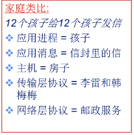

TCP:可靠、按序

UDP：基于“尽力而为”的**网络层**

# 3.2 复用和分用

多路复用/分用

传输层作为接收端必须进行**<u>多路分用</u>**,把从网络层所接受的报文段正确地交付给不同的进程:传输层依据头部信息将受到的Segment交给正确的Socket,即不同的进程  交给正确的Socket相应来说就能交给正确的进程

发送端进行**<u>多路分用</u>**:从多个Socket接收数据,为每个数据封装上头部信息,生成Segment,交给网络层

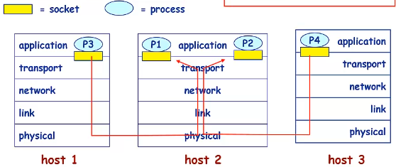

分用如何工作?

主机接收到IP**数据报**（网络层）（datagram）

数据报携带①源IP地址、目的IP地址②传输层的段（Segment）（每个段携带源端口号和目的端口号）

注：传输层的Segment格式（下图）

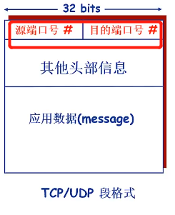

主机收到Segment之后，传输层协议提取**IP地址和端口号**信息，将Segment导向相应的Socket

？？？这啥玩意，为什么是主机收到Segment？不应该是传输层收到Segment，主机收到datagram吗

网络层会不会处理端口号信息呢？不会

## 1.无连接的分用

利用端口号创建Socket ，UDP的Socket用二元组标识（**目的IP地址，目的端口号**）

主机收到UDP段后，检查段中的目的端口号，将UDP段**导向**绑定在该端口号的Socket

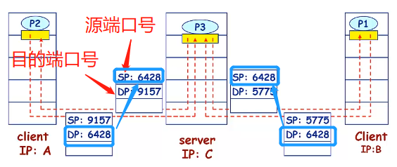

源端口号提供了返回地址：如果要P3如果要向P2反馈信息就会将目的端口号设为9157

## 2.面向连接的分用

TCP的Socket用四元组标识（**源IP地址，源端口号**，目的IP地址，目的端口号）

接收端利用所有的4个值将Segment导向合适的Socket

服务器会创建多个进程

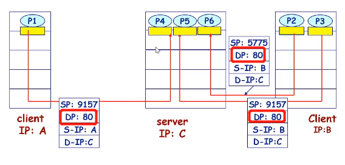

多线程Web服务器

Server上只有一个进程：可以让一个进程创建多个线程，通过不同的线程维持多个TCP连接

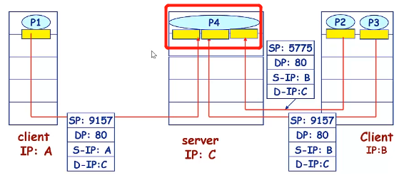

# 3.3 无连接传输协议UDP

基于Internet IP协议  做了多路复用和多路分用（传输层的基本功能）增加了简单的错误校验

Best effort （因为IP协议就是尽力而为）可能丢失、非按序到达

无连接：UDP发送方和接收方之间不需要握手，每个UDP段的处理独立于其他段

UDP存在的价值：①无需建立连接（减少延迟）②实现简单：无需维护连接状态

③头部开销少（UDP 头部8个字节，TCP头部20个字节）④应用可以更好地控制发送时间和速率

UDP常用语流媒体应用（容忍丢失、速率敏感）

UDP上能够实现可靠数据传输，但需要在应用层增加可靠性机制

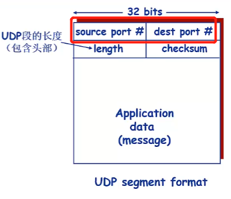

UDP校验和：检测UDP在传输中是否发生错误（如位翻转）

发送方：计算所有整数的和，进位加在和的后面，将得到的值按位求反，得到校验和，将校验和放入校验和字段

接收方：计算所收到段的校验和，

将其与校验和字段进行对比：相等也有可能有错误（例如2位翻转）

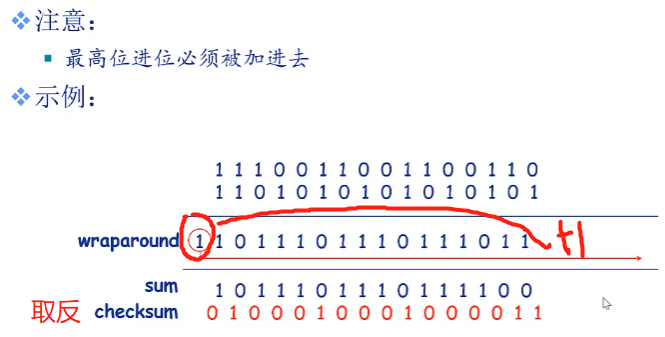

# 3.4 可靠数据传输原理

不错、不丢、不乱

RDT

UDT(不可靠)

在不可靠的信道上面实现可靠的数据传输并不是简单的单向数据流动，需要双向地控制消息的流动

因为控制信息一定是双向流动的

利用状态机（Finite State Machine,FSM)刻画传输协议

## Rdt1.0 可靠信道上的可靠数据传输

底层信道完全可靠：不会发生错误（bit error）不会丢弃分组

发送方和接收方的FSM独立

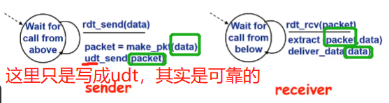

## Rdt2.0 只产生位错误的信道,不丢失

利用校验和检测位错误

确认机制ACK:接收方显式地告知发送方分组已经正确接收

NAK:接收方显式地告知发送方分组有错误

发送方收到NAK后重传分组

Rdt2.0中引入的新机制①差错检测②接收方反馈控制消息③重传

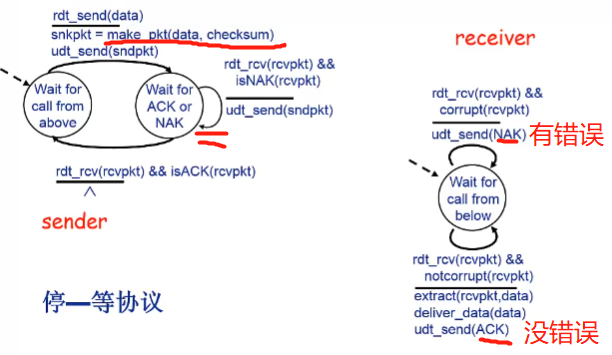

## Rdt2.1(ACK/NAK消息发生错误or被破坏)和Rdt2.2

如果ACK/NAK消息发生错误/被破坏会怎么样?重传

简单的重传会导致重复:前一个分组已经被正确接收,但是ACK坏掉了,又传了一次,这次也被正确接收,Juin重复了

如何解决**重复分组问题**?序列号:发送方给每个分组增加序列号,接收方丢弃**重复**分组

所以在Rdt2.0的基础上增加序列号就可以解决问题

发送端发一个分组,一直要等到接收方的回应

为什么只引入了**两个序列号**0和1???

因为我们采用的是停-等协议!

接收方在发送ACK和NAK的时候也要加入校验和

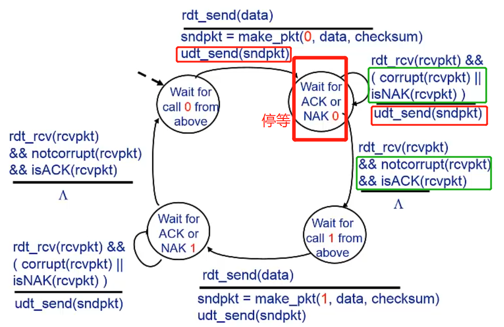

接收方:

A.希望收到0且收到0 ②分组没坏掉,则提取数据交付上层,发送ACK

B.①分组坏掉了，发NAK

C.①分组没坏掉,但是收到1,需要发ACK,为什么置之不理不行,发NAK不行?

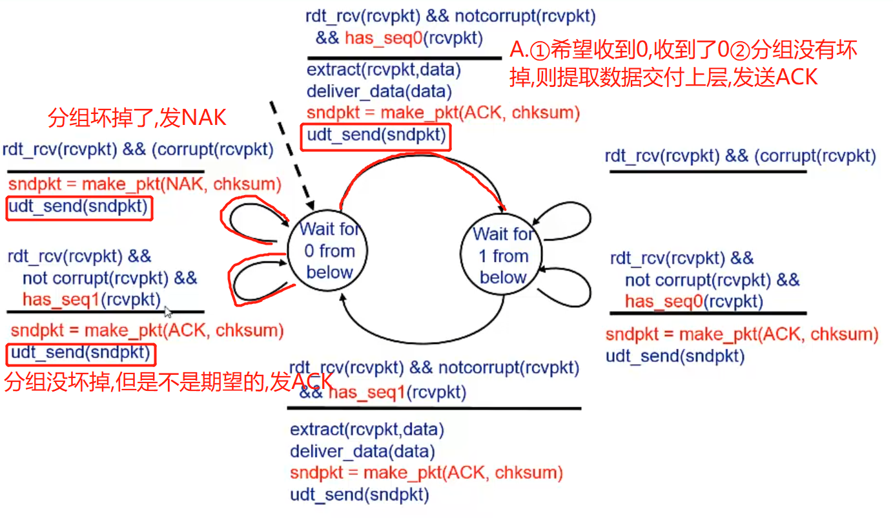

