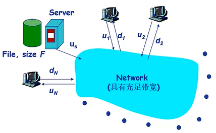

# 应用层

特定网络应用与协议

## 2.2 网络应用的基本原理

网络应用的体系结构：

​	客户机/服务器结构(C/S)	

服务器对外提供服务:7*24小时,永久性访问地址/域名,利用大量服务器实现可扩展性	

 客户机使用服务:与服务器通信,使用服务器提供的服务,间歇性接入网路,可能使用动态IP地址,不会与其他客户机直接通信

例如:PC:运行Edge浏览器 服务器:运行Web服务器软件

​	点对点结构(P2P)

没有永远在线的服务器

任意端系统/节点之间可以之间通信

节点间歇性接入网络

节点可能改变IP地址

例如:文件传输

有点:高度可伸缩 缺点：难于管理

​	混合结构

网络应用的基础：进程间通信

进程：主机上运行的**程序**

同意主机上运行的进程之间的通信：进程间通信机制，操作系统提供

不同主机上运行的进程之间如何通信？消息交换

客户机进程：发起通信的进程

服务器进程：等待通信请求的进程

（P2P也有这俩）

套接字（Socket）

进程间利用socket发送/接收消息

如何寻址进程?

进程的标识问题

寻址主机:**IP地址** 但是同一主机上可能有多个**进程**需要通信,需要**端口号**

进程的标识符:IP地址+端口号

应用层协议

网络应用对传输服务的要求

数据丢失/可靠性

时间/延迟

带宽

TCP与UDP的对比

# 2.3Web应用

World Wide Web

网页包含多个对象：HTML文件 JPEG图片等等

基本HTML文件：包含对其他对象引用的链接

对象的寻址：利用URL 统一资源定位器Scheme://host:port/path

## HTTP协议

C/S结构:客户是Browser请求接收展示Web对象 服务器是Web Server：响应客户的请求，发送对象

 非持久性连接：每个TCP连接最多允许传输一个对象

持久性连接：每个TCP连接允许传输多个对象

首先向HTTP服务器进程（端口80）发起TCP连接    服务器一直在80端口等待请求，接收连接，通知客户端

非持久性连接HTTP关闭TCP连接

RTT：从客户端发送一个很小的数据包到服务器并返回所经历的时间**（往返）**

**持久性HTTP**

发送响应后，服务器保持TCP连接的打开，后续的HTTP消息可以通过这个连接发送

改进1：无流水的持久性连接,客户端只有**收到前一个响应**后才发送新的请求，每个被引用的对象耗时1个RTT

改进2：带有流水机制的持久性连接：客户端只要遇到一个引用对象就尽快发出请求，理想情况下，收到所有的引用对象只需耗时约1个RTT

HTTP消息的格式：

**①请求消息**：

*<u>第一行：请求行request line*</u>

<u>*请求方法+URL+HTTP版本*</u>

<u>*头部行：*</u>

<u>*Host：balabala 声名访问哪个主机？为什么需要这个？有用吗？后面缓存和代理服务器会使用这个信息，不使用的时候就没用*</u>

<u>*User-agent：不同浏览器*</u>

<u>*Connection：连接开闭 ？**发完以后可以关闭？***</u>

<u>*Accept Language：fr*</u>

*<u>回车换行</u>*

<u>*底下是数据*</u>

通用格式：

比如登陆的时候有表单

上传输入的几个方法

（1）POST方法 ：在请求消息的消息体（Entity Body）中上传客户端的输入

（2）GET方法：输入信息比较少可以放到request行的URL字段里

（3）HEAD方法：告诉服务器不要把响应消息放到响应消息中（只返回头部的东西,一般做测试用)

（4）PUT方法：将消息体中的文件上传到URL所指定的路径

（5）DELETE方法：删除URL字段所指定的文件

**②响应消息**

第一行：状态行status line：使用版本+状态代码+解释

后面是头部行 其中Date是Web服务器生成响应消息的时间，Last-Modified是上次修改的时间

Server告知服务器这边的软件类型：一般是Apache

请求的HTML文件在下面返回回去

状态行:响应消息的第一行：

HTTP协议无状态，服务器不记录客户的历史行为

## Cookie技术

很多应用需要服务器掌握客户端的状态，例如网上购物（购物车）

为了辨别用户身份、进行session跟踪而**存储在用户本地终端**上的数据（通常经过加密）

放在HTTP响应或者请求消息的cookie头部行中

Cookie能够用于身份认证（保存密码，两周之内免登录）、购物车、推荐...

# Web缓存/代理服务器技术

功能:在不访问服务器的前提下满足客户端的HTTP请求

缩短客户请求的响应时间	减少机构的流量开销 在Internet实现有效的内容分发

用户设定浏览器通过缓存进行Web访问，浏览器向缓存/代理服务器发送所有的HTTP请求

条件性GET方法   和HTTP请求中的Last-Modified结合起来

# 2.4Email应用

邮件客户端

邮件服务器：Email应用的核心 为每个用户分配邮箱 代发 创建消息队列：存放要发出去的消息

SMTP协议：邮件服务器之间传递消息所使用的协议

客户端：发送消息的服务器

服务器：接收消息的服务器

为什么要采用这样的架构？否则当没有接入Internet无法接收邮件...

使用TCP进行email消息的可靠传输

传输过程的3个阶段:握手、消息的传输、关闭

HTTP采用请求/响应的模式

而SMTP采用命令/响应的模式

SMTP协议:使用持久性连接(每个TCP连接允许传输多个对象)

????多个对象在由多个部分构成的消息中发送????

文本消息格式标准

头部行header

消息体body

MIME：多媒体邮件扩展

通过在邮件头部增加额外的行以生命MIME的内容类型

<u>**SMTP是邮件传输协议**</u>

<u>**还需要邮件访问协议**</u>：从服务器获取邮件

∴Email应用使用了不止一个应用层协议

POP协议：POP3是无状态的

IMAP协议

采用下载并删除模式：用户如果换了客户端软件，无法重读该邮件

下载并保持模式：不同客户端都可以保留消息的拷贝

IMAP协议：

# 2.5 DNS应用

Domain Name System

Internet上主机/路由器的识别问题

IP地址

域名:www.bjtu.edu.cn

域名和IP地址之间的映射问题

域名解析系统DNS

是Internet核心功能,但是是用应用层协议实现

DNS服务①域名向IP地址的翻译②主机别名③邮件服务器别名④负载均衡:Web服务器

分布式层次式数据库

为了获得域名的IP地址进行了三次查询

本地域名解析服务器无法解析域名时

​								↓

​					根域名服务器(全球13个)

​								↓

​		顶级域名服务器(TLD top-level domain)负责com org net等顶级域名和cn uk等国家顶级域名

​								↓

​				权威域名服务器(Authoritative)组织的域名解析服务器,提供组织内部服务器的解析服务

​								

​	本地域名解析服务器(不严格属于层次体系,每个ISP有一个本地域名服务器,默认域名解析服务器)

当主机进行DNS查询值,查询被发送到本地域名服务器

作为代理,将查询转发给(层级式)域名解析服务系统

​			如果采用递归方法解析另一网络某主机域名时,用户主机\本地域名服务器发送的域名请求消息数分别为一条、多条

### DNS记录缓存和更新

本地域名服务器一般会缓存顶级域名服务器的映射

一段时间过后，缓存条目失效

因此根域名服务器不经常被访问

### DNS记录

DNS协议与消息

查询和回复协议

这两种消息的格式相同

# 2.6 P2P应用

没有服务器

任意端系统之间直接通信，结点阶段性接入Internet，结点可能更换IP地址

**（1）文件分发：客户机/服务器**

**(2)文件分发:P2P**

BitTorrent：

节点加入torrent一开始没有chunk，但是会逐渐积累。向tracker**注册**以获得节点清单，与某些节点（“邻居”）**建立连接**。**下载**的同时，节点需要向其他节点**上传**chunk。节点可能加入或离开。

给定任一时刻，不同节点持有文件的不同chunk集合。

总结：上传速率高，就能够找到更好的交易伙伴，从而更快地获取文件

### P2P索引技术

索引：信息到节点位置（IP地址+端口号）的映射

文件共享时，利用索引动态跟踪节点们所共享的**文件的位置**：节点告知索引拥有哪些文件；节点搜索索引，从而获知能够得到哪些文件。

QQ中，索引负责将用户名映射到位置：用户通知索引自己的位置；节点检索索引，确定用户的IP地址

**①集中式索引**：节点加入时，通知中央服务器自己的IP地址和持有的内容

单点失效问题、性能瓶颈、版权问题

**②洪泛式查询Query flooding**

每个节点**仅**对自身共享的文件进行索引

找到了然后建立连接：上图红色曲线

洪泛式查询会大量消耗网络带宽，导致网络拥塞

**③层次式覆盖网络**

节点分为两类：超级节点或者普通节点

普通节点和超级节点之间维持TCP连接（小区域是集中式）

超级节点之间维持TCP连接（洪泛式）

超级节点负责跟踪子节点的内容

Skype就采用了层次式覆盖网络：本质上是P2P的，用户/节点对之间直接通信;索引负责维护用户名与IP地址间的映射,索引分布在超级节点上(我自己的小弟(普通节点）&我的兄弟(邻居))

应用层协议定义了应用进程之间如何进行交互，事实上要利用传输层等底层进行传输

应用编程接口API（Application Programming Interface）

应用编程接口API:就是应用进程的控制权和操作系统的控制权进行转换的一个系统调用接口

典型的应用编程接口：套接字（socket） WINSOCK TLI

要通信就要先创建套接字！服务器先运行 客户后运行

对外的时候通过IP地址+端口号说明是哪个套接字

操作系统/进程管理套接字(对内)通过套接字描述符   套接字抽象机制

TCP/IP协议栈里端点地址表示为:IP地址+端口号

family:定义地址族,不同地址族的端点表示是不一样的   TCP/IP设置为AF_INET

TCP:可靠、面向连接、字节流传输、点对点

UDP：不可靠、无连接、数据包传输

服务器端一般需要指定熟知端口号，例如SMTP是25，Web是80

服务器端的流套接字处于监听状态，还要设置连接请求队列大小

UDP客户端只是指定服务器端点地址

TCP客户端是建立TCP连接

服务器端从处于监听状态的流套接字的客户连接请求队列中取出排在最前的一个客户请求，并且创建一个新的套接字来与客户端套接字创建连接通道，利用新创建的套接字与客户通信

解析服务器IP地址

解析服务器（熟知）端口号

解析协议号

通过多次循环来接收数据：因为TCP协议是流传输协议，发送端一次发送多少数据，接收端一次不一定接收这么多数据

UDP是数据报传输协议：要发送数据一定发送一个完整的数据报

