第10章：并行接口技术 10.25 10.27（配合课件食用） 

接口电路与外部设备之间采用多根数据线进行数据传输，以数据字节（字）为单位进行信息传递的接口。

除数据线之外，还可以设置握手联络信号线

### 10.3可编程并行接口芯片8255 (一共40个引脚)

10.3.1 8255外部特性

（1）面向系统总线的信号线

D0-D7：三态双向数据线

片选信号

2根地址线，4个端口，将来会连到系统总线的地址线中的A0，A1

（2）面向I/O设备的信号线

PA0-PA7:端口A的输入/输出线

PB0-PB7:端口B的输入/输出线

PC0-PC7:端口C的输入/输出线

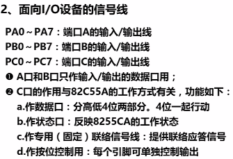

8255内部结构

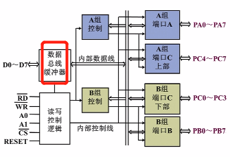

数据总线缓冲器

读信号产生后，才会将数据总线缓冲器打开，才会来到数据总线

不同的工作方式下，C口做数据口或状态口或作联络信号线

每个引脚都可以单独控制输出

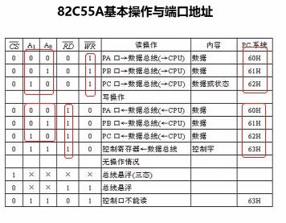

### 10.3.4 8255的工作方式

方式0：基本**输入或输出**方式

单向I/O，**一次初始化**只能指定端口（PA、PB和PC）作输入或输出，不能指定端口同时既做输入又做输出

适合无条件方式或查询方式传送

方式2:一次初始化将端口A置成既输入又输出,即双向输入/输出

### 10.3.5 8255的编程命令

1.方式命令

方式命令字的最高位必须是1

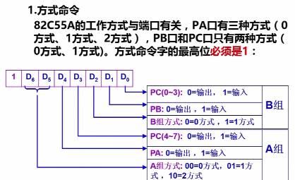

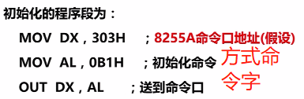

命令口主要是CPU向接口芯片发控制指令

**C端口按位置位/复位命令**

最高位是0

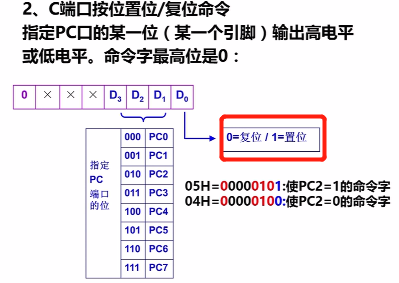

刚才是4位一起控制输入/输出(数据传输的方向),现在是对其中的某一位设定它的输出值

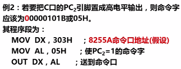

在一个引脚上(PCi)产生符脉冲

NOP:混时间用的,可以用来维持低电平  也可以用延时子程序

利用8255的PC6产生方波,送到扬声器,使其产生不同频率的声音

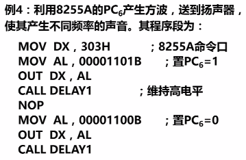

**按位置位/复位的命令代码只能写入命令口,而不能写到数据口(因为是命令)**

A口、B口也可以按位输出高低电平，但它与C口的按位置位/复位命令有本质的差别，并且实现的方法也不同。A口、B口按位输出是以送数据到A口、B口实现。

具体做法：要使某一位 置高电平，则先对端口进行操作，然后“或”上一个字节，此字节中的对应位为1，其他各位为0，最后再送到同一端口。

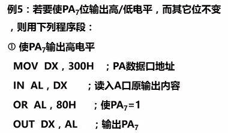

其他位是什么我不关心

和80H或使PA7为1

和7FH与使PA7为0

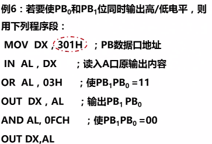

喇叭和开关SW一根引脚就够了 各用PC上下半的一个引脚

0000 110 0  也就是0CH   C6位输出低电平

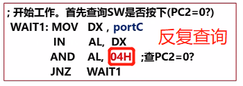

判断某一位是否为0？其他位都是0，我要查的那一位为1，做与运算

AL的结果变了无所谓，因为我只要1位

给的T参数不同，从而形成了高频和低频的区别

**靠延时常数**t控制长短

t大,生成的方波周期长,频率小

步进电机：

C口还是可以做数据口的，看到302H别觉得奇怪

