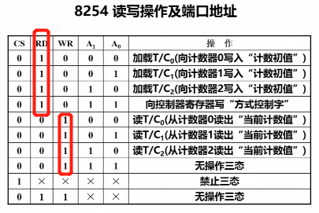

第九章

数时钟脉冲数

9.3 外部定时方法及硬件定时器

（1）软件定时：利用CPU内部定时机构，运用软件编程去循环执行一段程序而产生的等待延时。

由指令周期（CPU主频）决定的

（2）硬件定时

9.4 可编程定时/计数器8254

(1)与CPU连接的信号

数据线<u>:8根</u> 送什么数据？**主要送计数初值**，而不是像8255那样传送给外设的数据

地址线： 

片选+**8254内部也是4个端口**   <u>3根</u>

控制线：读、写  <u>2根</u>

（2）与外设连接的信号

时钟信号

门控信号（相当于启动开关）

输出信号

问：A0A1和选哪个计数器有关系吗？好像有关系，是某个定时器的数据口地址

内部结构：

三个**相互独立**的计数器（也可以联合起来实现功能）

CLK0是输入

GATE是控制开关（高电平有效），也是输入

把单独的一个计数器拿出来，看看内部结构

数据线是8位的，但是每个计数器内部的三个寄存器都是16位的，矛盾？

**所以只能分两次送了**

<u>16位的计数初值寄存器</u>是保存计数初值的

最大计数初值为65536

如果是BCD码，最大计数初值为**10000**     9999H

<u>减一计数器</u>**数下降沿**，来一个下降沿就减1

8254六个输出方式，减1到0结束，有不同的输出信号

<u>16位当前计数值锁存器</u>（就是字面意思）

8254有3个命令字和1个状态字

方式命令、锁存命令和读回命令，其中方式命令是必须的，其他两个命令根据需要使用

这是哪个命令字使用同一个端口，**按方式命令在先，其他命令在后的顺序写入端口**

1.方式命令

初始化8254，包括选定计数通道，设定工作方式，确定读写字节顺序以及计数值码值

怎么送计数初值？

向定时器里面的某个计数器的数据口送

连续地！先送低后送高！

总结：8254的初始化：首先是方式命令字，然后是计数初值

锁存命令：将减1寄存器的内容孙处到输出寄存器中以供CPU读取

向命令口发锁存命令

复习：8255里面没有状态口的概念，而且用方式0不需要考虑状态

方式0：（软启动）计数结束产生的信号作中断请求信号

当代码中写OUT指令，产生一个**WR低电平**

**写进方式字，OUT的输出是低电平**

第二步：写初值

写完初值，这个计数过程就启动了（软件启动）

并不是第一个下降沿就减1,第一个下降沿**将初值送到减1计数器里去**；在下一个下降沿（给正脉冲负脉冲不一样）来的时候才开始减1

总体来看：写方式字后，产生一定宽度的负脉冲

经常拿来作为中断请求信号，因为中断请求信号是负电平有效？

方式1：（硬启动）可编程（可以编程设定暂态时间）单稳（OUT高电平是稳态，暂态是低电平，计数完成又恢复成高电平）脉冲

写完方式字先高电平

紧接着写初值

方式1多了硬件启动，GATE本来是高电平，变低再变高（给一个脉冲信号）

而方式0是只要数据一进去，计数过程就开始了

初值寄存器放到减1计数器里面才开始减

计数过程结束后OUT变为高电平

方式3：（软启动）方波发生器

**输出信号周期包含高&低**，时长相同，占空比为1:1

要是奇数长度，高电平要比低电平长

这次计数结束后会自动继续装载计数初值

重复进行

方式2：分频器

产生的不是方波，负脉冲的占空比非常小（一个基准时钟信号）

方式4：选通信号，也是一次性的

（软件触发，代码一执行就开始计数）

再写一次计数初值（**计数初值的重写**）

如果GATE信号突然来了低，终止了

**启动之后重新计数**

方式5：硬件触发选通信号

方式1和方式5硬件启动

连续的脉冲信号就用方式2和3

计数初值的计算两种方法

### 9.5定时/计数器的应用

每个计数器有一个地址

延时子程序控制声音长短

关扬声器子程序:

61H是8255

一开始不让扬声器发声

计数器的GATE   产生不了方波信号

扬声器的门也没开

**在B端口做按位输出**

开扬声器子程序:

最后两位变成1

主程序:有键按下开始发音

0bH:看有没有键按下

08H:看是哪个键,是不是1BH

GATE信号一来,立即启动

是软启动，不是硬启动

p52 1000改成500

书上几个例子可以看一看，比较有启发意义