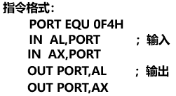

**第八章**10.20

利用端口实现CPU和外设的数据交换

为端口进行编址

为I/O**接口中的端口**分配地址

端口就是**输入输出接口电路中的存储部件**，以字节组织数据(端口保存的数据长度是一个字节)

复习:**8086内存单元地址20位**(段寄存器+偏移地址)

I/O地址是16位的，范围是0000H-0FFFFH，共2^16=64K个可单独寻址的**8位**端口

两个相邻的端口可以构成一个16位的端口(这时候就可以传字了)

16位端口对应于偶数地址(偶对齐)

CPU要和外设进行数据交换的时候,CPU只能看到输入输出接口电路

CPU通过这些I/O接口中的端口读取状态和传送数据

所以一个I/O接口中通常包含几个端口:命令口 状态口(外设的状态,不是CPU的状态) 数据口

某个端口可能有多个功能(复用)

复习:CPU和内存通过总线连接

那I/O端口地址0000H-0FFFFH如何实现?

I/O端口地址编址方式

1.独立编址

不和存储器地址空间合在一起

2.统一编址

**1.I/O指令IN和OUT**

站在CPU的角度来说进和出

IN指令从I/O端口向AL(AX)输入字节(字)

OUT指令从AL(AX)向I/O端口输出字节(字)

300H代表输入输出端口的地址

IN AL,DX长度不匹配?

DX代表的不是数本身,而是**地址**

从端口地址为DX内容的那个端口向AL输入一个字类型的数据

MOV [DI],AL

**从300端口送一个字节数据到存储器中,用MOV指令**(外设->CPU->存储器）

2. I/O端口寻址方式

   直接寻址：在IN指令中直接给出地址，当**端口地址是8位**，用一个字节就能表示

   如果地址比较大，超过一个字节**（端口地址是16位）**，用间接寻址，**只能用DX**

   

​	

会有响应信号产生！

### 8.3 I/O端口地址分配

8.3.1PC微机I/O地址的分配

IBM只用了低10位地址线，总共只有1024个端口

8.4 I/O端口地址译码（重要）

全译码：地址线A0到A9全部参与译码，一般在采用单端口时使用

部分译码：只有**<u>高位地址</u>**（下面74138的例子体现了）参加译码，产生片选信号

​					地位地址线直接接芯片，作为**片内**寻址

​					（一般用于有多个接口芯片的系统）

开关译码法

​	选段 选芯片 选芯片中端口

译码电路的输入信号（地址+控制信号）

输出：片选信号（**低电平**）

例：设计一个地址为2F8H的地址译码电路

​				

读信号有效，数据可以进来，因为是“只读”

产生有效读信号，执行IN指令

可读可写

3个引脚作片选（因为74138），片内32地址的寻址用5根地址线

闭合是0，断开是1

异或:相同为0，不同为1

