# 计算机网络的概述

## 1.1计算机网络的基本概念

**主机**（hosts）=端系统（end systems）

通信链路：光纤 铜缆 无线电 卫星

分组交换：转发分组（数据包）路由器和交换机

通过交换网络连接主机

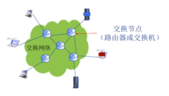

ISP:    Internet Service Provider

Internet为网络应用提供编程接口(API)

网络协议三要素:语法 语义(要进行差错控制) 时序

## 1.2计算机网络的结构

### 	①主机(端系统)位于网络边缘

​			上面运行各种网络应用程序,例如Web Email

​			客户/服务器应用模型

​			对等(P2P)应用模型

### 	②接入网络:将网路边缘接入核心网(边缘路由器)

​			带宽:一般指数据传输速率

​			共享/独占

​			物理介质:有线或无线通信链路

#### 		(1)DSL：数字用户线路  ADSL:非对称数字用户线路 <u>利用电话线</u>

​			**<u>*采用多路复用*</u>**，多路信号共同使用一个物理介质

​			上行和下行线路速率不一致

​			频分多路复用

​			**<u>独占</u>**

#### 	（2）电缆网络：**有线电视网络**

​			**<u>*频分多路复用*</u>**

​			HFC：混合光纤同轴电缆

​			非对称

​			**<u>共享</u>**各个家庭共享家庭至电缆头端的接入网络

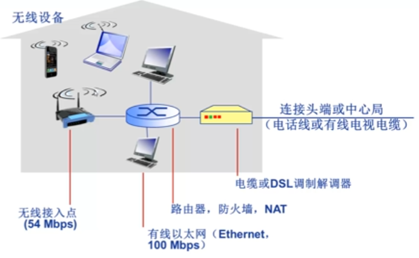

#### 		（3）机构接入网络

​				通过局域网连接网络的机构路由器，机构路由器再进一步连接ISP的链路

#### 		（4）无线接入网络

​				通过基站

​				无线局域网（LANS）

​				广域无线接入

### 	③网络核心:路由器	实现数据从源主机通过网络核心送达目的主机

​			（1）路由

​				网络核心的关键功能：路由+转发

​				本地转发表（路由表）

​			（2）转发

​				将分组从路由器的输入端口交换至正确的输出端口

​				

### 	④Internet网络结构

端系统通过**<u>接入ISP</u>**连接到Internet网络，**<u>接入ISP</u>**必须进一步互联

ISP:    Internet Service Provider

每个**接入ISP**直接彼此互联?

将每个**接入ISP**连接到一个Global ISP？

对等链路或IXP（Internet exchange point）大的ISP直接的互联

区域ISP

网络内容提供商：谷歌 微软

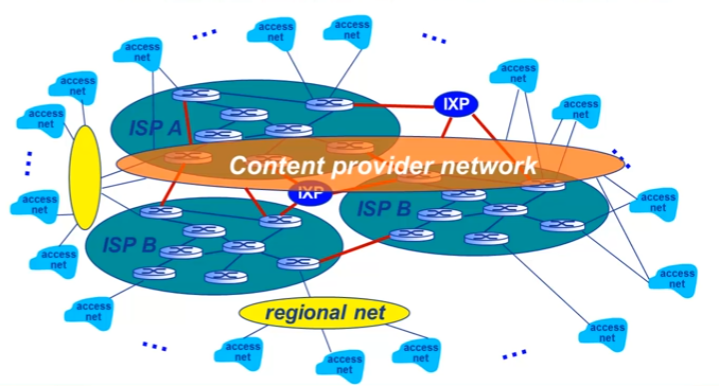

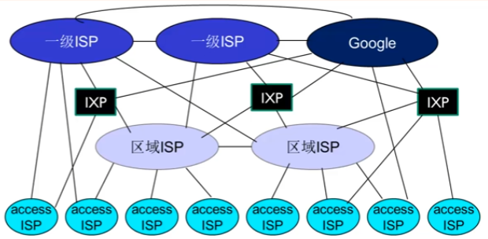

## 1.3网络核心

数据交换

交换设备    把交换设备互联在一起

### ①电路交换

三个结点：建立连接（呼叫/电路建立)

通信

释放连接（拆除电路)

**<u>独占资源</u>**

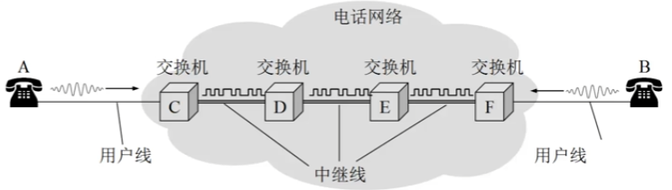

???			懂了

电路交换网络的链路共享:红色和蓝色需要共享

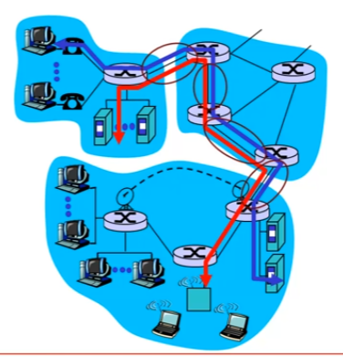

并不是其他通话就不能用了

使用多路复用技术

### ②多路复用技术

不能保证每一对通信之间都有单独的物理链路

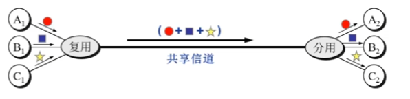

链路/网络资源划分为资源片

将资源片分配各路呼叫 资源片可能闲置

每路呼叫**<u>独占</u>**分配到的资源进行通信

资源片可能闲置(无共享)

典型多路复用方法:频分、时分、波分、码分

#### （1）频分多路复用FMD

频分多路复用的各用户占用不同的频率带宽资源

#### （2）时分多路复用TDM

将时间划分为一段段等长的时分复用帧

每个用户所占用的时隙是周期性出现

时分复用的所有用户在不同的时间占用相同的频带宽度

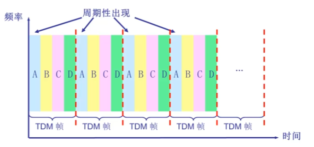

#### （3）波分多路复用WDM

不同波长

####  (4) 码分多路复用

每个用户分配一个唯一的mbit码片序列

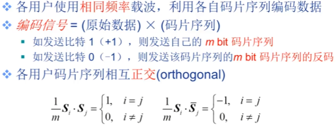

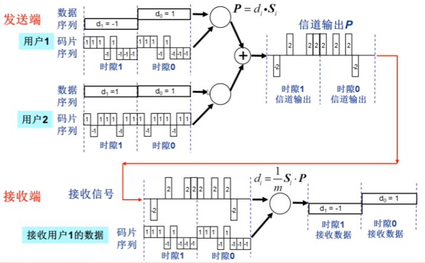

电路交换：电路一旦建立，通信双方所占用的电路资源是不能够被第三方共享的，资源独占

### ③ 报文交换message switching

发送信息整体（比如一个文件）

### ④分组交换packet switching

报文拆分出来的一系列相对较小的数据包

分组交换需要报文的拆分与重组

**<u>链路共享并不是事先分配好的！</u>**

利用全部带宽进行转发       看谁发的数据多

称为**统计多路复用**

存储-转发

报文交换和分组交换都采用存储-转发方式

报文交换以较小的分组进行“存储-转发”

### ⑤传输延迟

作为源主机在链路上发送每一个分组都是一个bit一个bit发送的

发送一个分组的第一个bit开始到最后一个bit发送结束，时间称为传输延迟

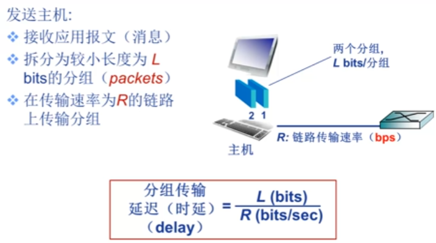

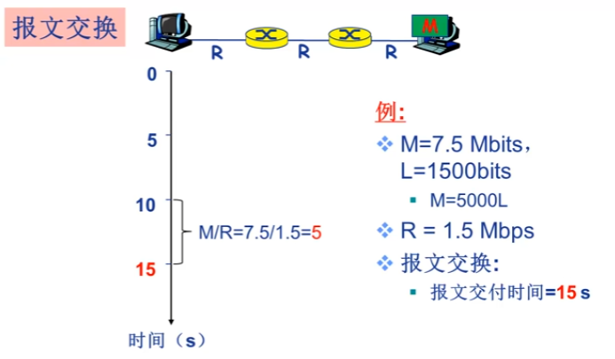

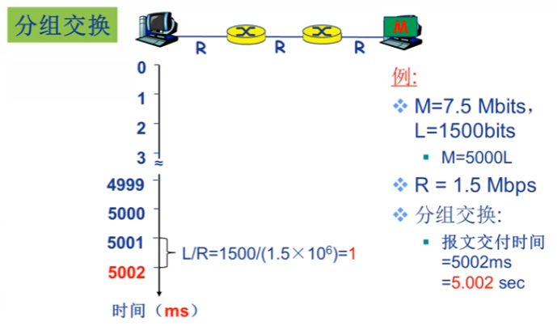

报文交换是串行的，分组交换并行

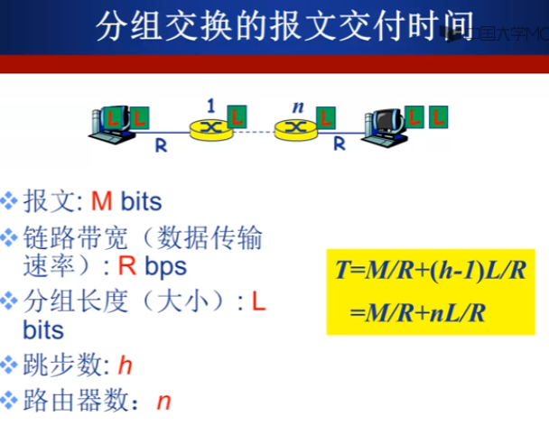

### ⑥电路交换VS分组交换

 电路交换不能共享，没拆除电路别人就不能使用

分组交换允许更多用户同时使用网络——网络资源充分共享

分组交换适用于突发数据传输网络

可能产生拥塞:分组延迟和丢失，需要协议餐护理可靠数据传输和拥塞控制

## 1.4 计算机网络性能

速率=数据率=数据传输速率=比特率

单位时间传输信息量 b/s kb/s...

≈带宽:数字信道所能传输的最高数据率    kb/s  Mb/s

**吞吐量/吞吐率**

在发送端与接收端之间传送数据速率(b/s)

即时吞吐量：给定时刻的速率

平均吞吐量：一段时间的平均速率

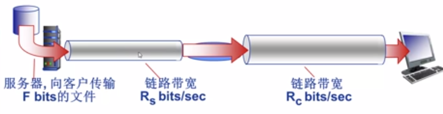

若Rs小于Rc，吞吐率取决于Rs

瓶颈链路：端到端路径上，限制端到端吞吐量的链路

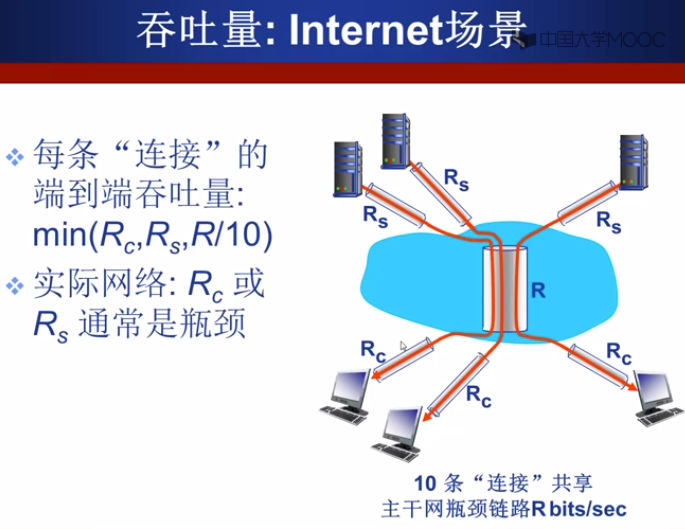

延迟/时延

前面介绍了传输延迟

**分组丢失(丢包)**

分组交换为什么会发生丢包和时延?分组在路由器缓存中排队,队列缓存容量有限,丢弃分组可能由前序结点或源重发(也可能不重发)

分组到达速率超出输出链路容量,就需要排队

丢包率=丢包数/已发分组总数

**<u>一跳中的四种分组延迟:</u>**

(1)dproc:结点处理延迟 nodal processing delay

​		差错检测 确定输出链路 

(2)dqueue:排队延迟 

​		等待输出链路可用

​		取决于路由器拥塞程度

​		链路带宽：bps

​		分组长度：L

​		a：平均分组到达速率

​		**流量强度：La/R**

​		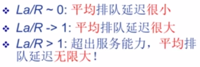

​		

(3) dtrans:传输延迟

​		取决于分组长度和链路带宽:dtrans=L/R

(4) dprop:传播延迟

​		和物理链路长度d以及信号传播速度s有关

​	 dprop=d/s

**时延带宽积**(又称以比特为单位的链路长度)=传播时延×带宽=R*dprop		单位是bit

当一个bit到达最终目的的时候,一共发出了多少bit(这个链路上能容纳多少bit)

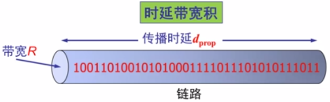

## 1.5计算机网络体系结构

分层结构

从功能上描述计算机网络结构

协议是控制两个对等实体进行通信的规则的集合，协议是”水平的“；下层写一点实现对上层的服务用户是透明的。

相邻层之间存在服务和被服务关系，服务是“垂直的”

## ①OSI参考模型

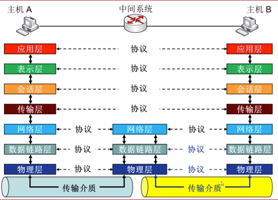

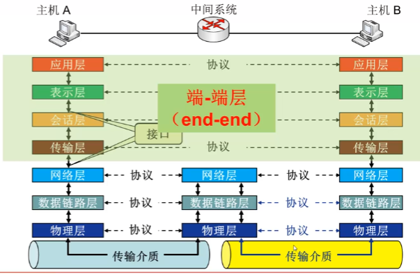

层和层之间为什么要加头？增加控制信息，控制信息主要包括地址（标识发送端\接收端)、差错检测编码、协议控制等

**物理层功能:**

接口特性

比特编码:如何表示0或1

数据率：数据传输速率

比特同步：发送和接收设备之间，时钟信号

传输模式：单工，只能A给B	半双工，可以双向，但只能交替进行（收的时候不能发）   全双工(可以同时进行)

**数据链路层功能：**

**<u>负责结点-结点数据传输</u>**（物理链路直接相连的两个相邻结点之间的数据传输）——以帧为单位

组帧：加头加尾

<u>物理寻址在数据链路层，不在物理层</u>

在帧头中增加发送端和接收端的物理地址，标识数据帧的发送端和接收端

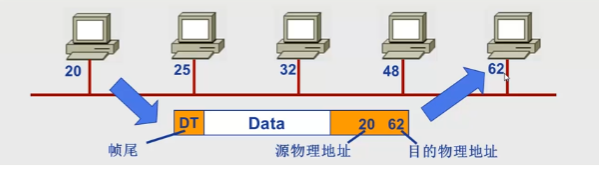

流量控制Flow Control，避免淹没接收端

差错控制Error Control

访问（接入）控制:在任一给定时刻决定哪个设备拥有链路（物理介质）控制使用权

**网络层功能**

**<u>负责源主机到目的主机数据分组packet交付</u>**

逻辑寻址（**全局唯一**逻辑地址，确保数据分组被送达目的主机，如IP地址）

路由：选路径

分组转发：

字母：网络层唯一逻辑地址

绿色：物理地址

构造网络层的协议数据单元

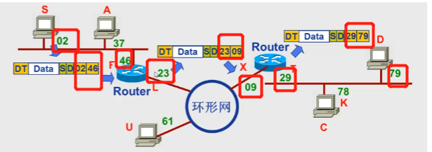

网络层：源主机到目的主机可以跨越网络的数据分组传输

**传输层**

传输层的数据单元：段

**<u>负责源-目的（端-端）（进程间）完整报文传输</u>**

功能：①分段与重组

SAP寻址：确保将完整报文提交给正确进程，如<u>端口号</u>

源和目的的端口号

S和D相当于网络层的逻辑地址

数据帧中有物理地址

②端到端的连接控制（逻辑连接）

③流量控制

④差错控制 TCP能实现，UDP不能

**会话层**

功能：对话控制 （建立维护）

​			同步  在数据流中插入“同步点”

**表示层**

数据表示转化

加密\解密

压缩/解压缩

**应用层**

HTTP 	FTP	SMTP

支持用户通过用户代理或网络接口使用网络

## ②TCP/IP参考模型

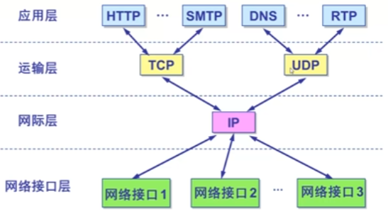

## ③5层参考模型

应用层 传输层 网络层 数据链路层 物理层

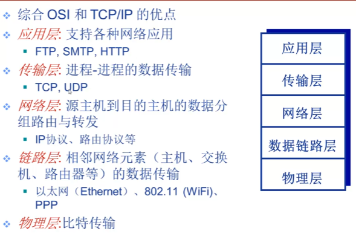

报文(message)->段(segment)->数据报(datagram)->帧(frame)

应用层			 ->		   传输层->					网络层->链路层

多路复用 共享 独占分别指的是什么

好像不管是独占还是共享都能多路复用

